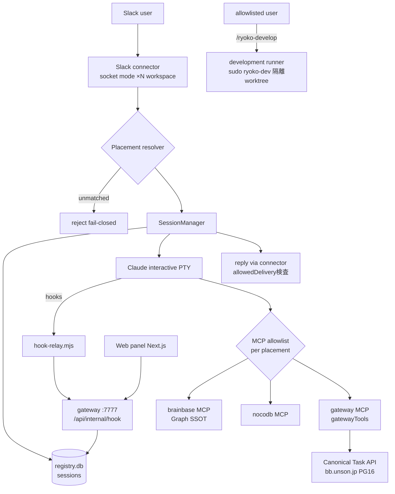

# システム全体設計

**最終更新**: 2026-07-30（discovery棚卸しに基づく現在地）

## 1. システム概要

mana-runtimeは、Slack上の単一窓口AI社員「マナ」を動かすゲートウェイランタイム。複数のSlackワークスペース/チャンネルに常駐し、チャンネルごとに権限境界（placement）を分けたうえで、Claude等のエンジンに会話・タスク管理・定常業務を実行させる。

- 表の窓口はマナ1体。裏でエンジン・モデル・権限を振り分ける（専門エージェント乱立の否定）
- 上位目標・優先順位は [roadmap.md](../management/roadmap.md) を正とする
- パッケージ名は歴史的経緯で `openryoko`（旧名。upstream jinnからのfork）。リポジトリ旧名 `brainbase-mana` は `mana-runtime` へリダイレクトされる

## 2. 主要コンポーネント

| コンポーネント | 実装 | 役割 |
|---|---|---|
| Gateway server | `packages/jimmy/src/gateway/server.ts` | 起動・config hot-reload・HTTP API（localhost:7777）・hook受信・WebSocket PTYビュー |
| Connectors | `src/connectors/{slack,discord,telegram,whatsapp,cron}` | 各プラットフォームの受発信。Slackはsocket modeで**named instance複数**（ワークスペースごと、env-backedトークン） |
| Placement resolver | `src/shared/placement-profile.ts` ほか | チャンネル→placement（権限プロファイル）の一意解決。不一致はfail-closed |
| SessionManager | `src/sessions/manager.ts` | メッセージ→セッションの経路制御。placement権限バインド・エンジン実行・リトライ/フォールバック・返信整形 |
| Session registry | `src/sessions/registry.ts` → `~/.ryoko/sessions/registry.db`（SQLite） | セッション・メッセージ・engineSessionId・コストの永続化 |
| Engines | `src/engines/`（claude-interactive PTY / claude headless / codex / gemini / mock） | LLM実行。本番主経路はClaude interactive PTY（Max課金経路）。placement下ではclaude/mockのみ許可 |
| Hook relay | `~/.ryoko/hook-relay.mjs` → `POST /api/internal/hook` | PTY内Claude Codeのhook（SessionStart/Stop等）をgatewayへ中継。loopback+共有シークレット |
| Gateway MCP | `src/mcp/gateway-server.ts` | placementで明示許可した`gatewayTools`（create_task等）だけをClaudeへ公開 |
| Development runner | `src/sessions/development-runner.ts` + `scripts/development-runner/` | `/ryoko-develop`: 別Unixユーザー`ryoko-dev`の隔離worktreeで自己開発（VibePro guarded、`pr_ready`で停止） |
| 議事録パイプライン | roadmap柱4系（`MeetingTaskProposalNotifier`ほか） | transcript→議事録生成→チャンネル展開→タスク候補提示→承認でCanonical Task登録 |
| Web panel | `packages/web`（Next.js静的出力→`dist/web`） | 管理UI・xterm PTYビュー |
| Run receipt / health | `scripts/systemd/`（timer） | 実行レシートの収集配送・pilot死活監視 |

## 3. システム構成図

## 4. データの流れ（代表経路）

1. **会話**: Slackメッセージ → connector（respondTo gate: mention等） → placement解決・audience認可 → SessionManagerがセッションをsessionKey（channel:thread）で解決 → placement権限バインド（同一権限ならengine transcript維持、変更ならクリア） → Claude PTYへプロンプト注入 → hook経由で結果回収 → 配信先検査のうえ返信
2. **タスク**: 会話中のタスク操作 → gateway MCPの`create_task`等（placementで許可された場合のみ） → companion API（bb.unson.jp、single-writer） → Slack Canvasミラー・期限リマインダー（cron）
3. **議事録**: transcript(.txt)が`9940-meeting-router`へ → 振り分け → DAG段構成で議事録生成（Graph SSOT・前回議事録参照） → プロジェクトチャンネル展開 → タスク候補提示 → 承認ボタンで冪等登録
4. **自己開発**: `/ryoko-develop <依頼>` → 固定argvで`sudo -u ryoko-dev`のランナーへstdin JSON → VibePro guarded run → 固定スキーマのJSON結果のみSlackへ

## 5. 外部サービス連携

| サービス | 用途 | 連携方式 |
|---|---|---|
| Slack | 主要UI（複数ワークスペース） | socket mode（named connector instances、トークンはenv-backed） |
| Anthropic Claude | 主エンジン | Claude Code CLI（interactive PTY / headless `-p`） |
| OpenAI Codex / Google Gemini | 代替エンジン | CLI（placement下では使用不可） |
| bb.unson.jp | Graph SSOT参照・Canonical Task正本（PostgreSQL 16 / Lightsail） | brainbase MCP（read）+ companion task API（service token、deleteはエージェント非公開） |
| NocoDB | 業務テーブル | NocoDB MCP |
| Discord | 通知（rate limit等）・remote proxy | bot / service principal |

## 6. 技術スタック

| 領域 | 技術 |
|---|---|
| Runtime | Node.js ≥22 / TypeScript / pnpm workspace（`jimmy`=gateway本体, `web`=管理UI） |
| Slack | Bolt (socket mode) |
| PTY | node-pty + xterm（WebSocketビュー） |
| 永続化 | SQLite（better-sqlite3、`~/.ryoko/sessions/registry.db`）・YAML config（`~/.ryoko/config.yaml`、hot-reload） |
| 本番 | AWS Lightsail（pilot 18.178.86.244）・systemd `openryoko.service`・Unixユーザー`ryoko`（実行）/`ryoko-dev`（自己開発隔離） |
| テスト | vitest / Playwright（e2e） |

## 7. 関連資料

- [認証・権限設計](./04_auth_permission.md) — placement境界の詳細
- [会社の脳との接続](./10_company_brain.md) — **目標アーキテクチャ**。本章は現在地であり、実行時Graph参照・学習候補送信・裏側ルーティング層は10が方向を定める（脳そのものの設計はbrainbase側が正本）
- [データストア設計](./02_data_design.md)
- [ログ・監視設計](./06_logging_monitoring.md)
- 機能単位の設計: `story-*.md`（VibePro系統）
- 歴史資料: [jimmy-design.md](../plans/2026-03-06-jimmy-design.md)（placement導入以前の初期設計）
