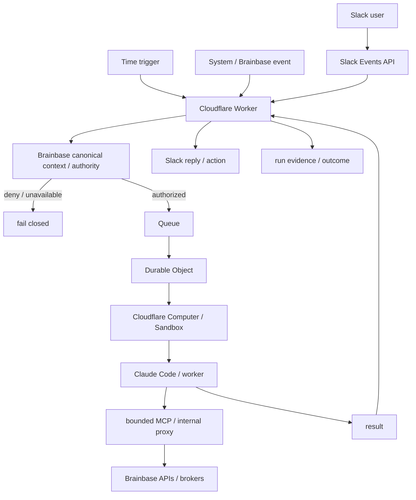

# システム全体設計

**最終更新**: 2026-08-20

## 1. システム概要

`mana-runtime` は、Slack・定期イベント・システムイベント・人間の依頼を入口に、Brainbaseの組織状態・記憶・権限を利用して判断と実行を継続するManaのCloudflare-native実行基盤である。

現行runtimeの正本は `packages/cloud-runtime/`。Jimmy / Jinn / OpenRyoko由来のLightsail常駐gatewayは廃止済みであり、現行アーキテクチャには含めない。

基本原則:

- 表の窓口はMana。裏で必要なworkerを選択する。
- Brainbaseはmemory / organization state / ontology / authorityの正本。
- ManaはOperating Loopとruntime executionを担当する。
- Claude Code / Codex等はworkerであり業務SSOTではない。
- tenant / workspace / project / capability / effect境界はLLMに推測させず、Brainbase canonical contextで検証する。
- companyごとにCloudflare deploymentとprovider credential boundaryを分離する。

## 2. 主要コンポーネント

| コンポーネント | 実装 | 役割 |
|---|---|---|
| Cloudflare Worker | `packages/cloud-runtime/src/` | Slack Events API、HTTP ingress、tenant/workspace境界検証、Brainbase proxy、response orchestration |
| Queue / DLQ | Cloudflare Queues | 非同期処理、retry、repair、失敗隔離 |
| Durable Objects | `packages/cloud-runtime/src/` + Wrangler bindings | tenant/runtime状態、冪等処理、短期coordination |
| Cloudflare Computer / Sandbox | `@cloudflare/computer` / `@cloudflare/sandbox` | company別の隔離worker execution |
| Claude Code worker | Cloudflare Sandbox内 | 会話、議事録、タスク処理、開発等のagent execution |
| Brainbase runtime boundary | service bindings / trusted forwarding | canonical identity、organization/project context、authority、task/knowledge access、credential brokerage |
| Task search/write MCP | `packages/cloud-runtime/container/` | Sandboxから限定されたtask read/write能力だけを公開 |
| Development runner | `packages/cloud-runtime/container/` | 隔離worktreeでVibePro/Claude Codeを実行。PR readyまでで停止し、push/merge/deploy authorityを持たない |
| Shared task runtime | `packages/task-runtime-core/` | task executionの共通primitive |
| Slack thread context | `packages/slack-thread-context/` | Slack thread contextの安全な抽出・正規化 |
| Write broker | `packages/write-broker/` | 書込み能力のbounded broker |
| Web surfaces | `packages/web/` | Mana管理・可視化UI |

## 3. システム構成



## 4. 代表的なデータフロー

### Slack turn

1. Slack Events APIでeventを受信する。
2. signing secret、workspace/app/deployment境界を検証する。
3. observed provider identityとrequested actionをBrainbaseへ渡す。
4. Brainbaseがcanonical actor、organization/project、capability、desired effect、authority evidenceを返す。
5. authority不一致・取得不能ならfail closedする。
6. Queue / Durable Objectで冪等に処理する。
7. Cloudflare Computer / Sandbox内でworkerを実行する。
8. 必要なBrainbase read/writeはbounded MCP / internal proxyを通す。
9. 結果を検証し、許可されたSlack actionを行う。
10. outcome / evidenceをBrainbaseへ記録する。

### Task read/write

SandboxへBrainbase tokenや署名鍵を渡さない。Sandbox内stdio MCPは合成internal hostのみを呼び、Worker / trusted serviceがtenant、project、actor、capability、idempotency、credentialを再構成してBrainbaseへ接続する。

### Meeting minutes

transcript / meeting eventを受け、Brainbase contextを参照してworkerが議事録・候補を生成する。canonical task mutation等の副作用はauthorityを確認した別actionとして扱う。

### Development execution

Manaがコード変更を必要と判断した場合、隔離Sandbox / worktreeでClaude Code + VibeProをworkerとして起動する。workerは実装・test・gate evidenceまでは進められるが、push / PR merge / production deployを自己承認しない。

## 5. Deployment model

同じCloud runtime実装から会社別profileを生成する。

| Profile | Config | 境界 |
|---|---|---|
| TechKnight | `packages/cloud-runtime/wrangler.jsonc` | TechKnight専用Cloudflare account/resources/Slack App/credentials |
| 雲孫事業運営 | `packages/cloud-runtime/wrangler.unson-business.jsonc` | 雲孫専用account/resources/Slack App/credentials |
| Dedicated Cloud | `packages/cloud-runtime/wrangler.dedicated-cloud.jsonc` | 顧客専用deployment |
| Customer-managed | `packages/cloud-runtime/wrangler.customer-managed-oss.jsonc` | 顧客管理境界 |

会社間でWorker、Queue/DLQ、Durable Object、Computer/Sandbox、Slack installation、provider credentialを共有しない。

## 6. 技術スタック

| 領域 | 技術 |
|---|---|
| Runtime | Node.js 22+ / TypeScript / pnpm workspace |
| Edge / ingress | Cloudflare Workers |
| Async | Cloudflare Queues / DLQ |
| Stateful coordination | Durable Objects |
| Agent sandbox | Cloudflare Computer / `@cloudflare/sandbox` |
| Primary worker | Claude Code |
| Organizational control plane | Brainbase |
| UI | Next.js (`packages/web`) |
| Test | Vitest / Wrangler dry-run / deployment-specific verification |

## 7. Brainbaseとの境界

Brainbaseが正本:

- canonical identity
- organization / project state
- Graph / Personal KG / decisions
- RACI / policy / company authority
- task / sprint / ship SSOT（Brainbase管理対象）
- audit / run evidence

Mana Runtimeが保持するruntime state:

- active execution
- Queue / retry / DLQ
- Durable Object coordination
- sandbox lifecycle
- connector delivery state
- short-lived planning/execution context

`can_do != allowed_to_do` を原則とし、Mana/LLMがauthorityを自己生成しない。

## 8. Operating Loop

Manaはtime / event / state / human triggerから起動し、次の循環を所有する。

```text
Observe
 -> Understand
 -> Decide
 -> Authority check
 -> Act
 -> Verify
 -> Record to Brainbase
 -> Continue / escalate
```

`ohayo`、`oyasumi`、`retro`の詳細は [Mana Operating Loop と Brainbase の製品境界](./mana-operating-loop-product-boundary.md) を正本とする。

## 9. 関連資料

- [Mana Operating Loop と Brainbase の製品境界](./mana-operating-loop-product-boundary.md)
- [Cloudflare Runtime canonical ADR](../adr/2026-08-20-cloudflare-runtime-canonical.md)
- `packages/cloud-runtime/README.md`
- `docs/operations/`
- `docs/management/roadmap.md`
