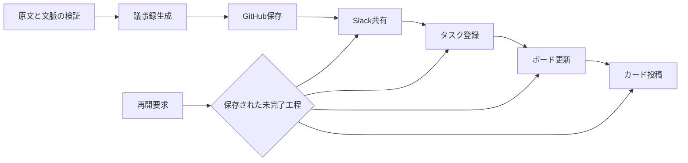

# 議事録の工程別再開

Story: [議事録の未完了工程だけを安全に再開する](../stories/meeting-minutes-stage-resume.md)

## 責務と正本

生成前は原文のハッシュと文脈Receiptを検証し、生成された本文・タスク候補を保存する。GitHub保存後は本文の生成を確定済みとして扱い、共有工程から原文取得・文脈取得・生成を呼ばない。

文脈Receiptは既存のrun保存領域内で保持する。これは生成とタスク重複照合に使用した入力であり、現在の外部書き込み権限を与えるものではない。外部操作は既存のtenant境界で毎回検証する。保存済みReceiptにもrun、原文ハッシュ、project、ID、checksumの一致を要求する。

新規処理と再開処理は同じタスク連携関数を通る。タスク登録→ボード→カードの順序と既存冪等キーを維持し、失敗工程から再開する。表示と管理APIとの互換性のため既存の `completed + taskRegistration.failure` は維持し、利用者には一部未完了として表示する。

旧runはReceiptの全体を持たない。共有には取得を要求せず、未登録タスクがある場合だけ同じReceiptを取得する。取得不能時は共有成果物を保持しタスク連携だけを保留する。監査ReceiptのIDすらない旧runは、新しいReceiptで過去の生成根拠を補わずタスク連携を保留する。ボードとカードの修復はReceiptを必要としない。

完了表示修復では既存の成果物・座標チェックを維持する。Slack更新が成功してから正本を更新し、その保存まで成功した場合だけ修復成功を返す。

## 契約の整理

現行の生成はWorkerが取得したReceiptを入力し、対話Hookなし・モデル用MCPなしで出力を検証する。過去のHook/Stop必須設計は現行契約として利用しない。モデル・実行時間・全文処理の見直しは実行器の停止原因の検証後に行う。

## 互換性とロールバック

既存runの版、識別子、保存先、Task pending入力、Slackチャンク番号は変更しない。Receipt全体の保存は任意フィールドの追加で、旧コードは既存監査項目を引き続き読める。ロールバック時に生成物・Taskを削除しない。

状態の競合更新や外部送信直後のクラッシュを包括的に解決するCAS・照合基盤は、この切り出しの達成事項に含めない。
