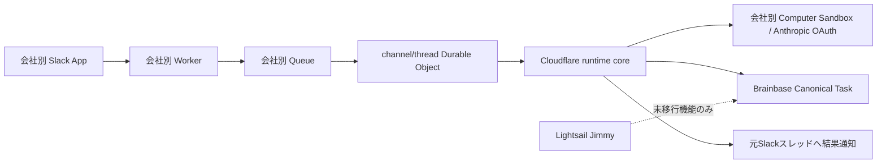

# Cloudflare主runtimeアーキテクチャ

## 決定

Cloudflare Worker、Queue、Durable Object、Computer SandboxをOpenRyokoの主runtimeとする。
業務ロジックは会社非依存のCloudflare runtime coreへ置き、TechKnightなど会社ごとの差は
deployment設定とsecretだけで表す。LightsailのJimmyは段階移行中の互換アダプターであり、
新しい正本ロジックの所有者にはしない。

最初の縦断は「Slack議事録タスク化依頼 → Claudeによる候補抽出 → Brainbase登録 →
Slack結果通知」とする。BrainbaseはCanonical Taskの正本としてCloudflare外に残す。

## 責務境界

- Worker adapter: Slack署名検証、deployment identity固定、Queue投入、Slack API/secret接続。
- Durable Object: channel/thread単位のイベント、処理段階、完了記録、冪等性。
- runtime core: 議事録タスク化の判定、候補検証、Brainbase入力生成、結果集約。
- Computer Sandbox: Claude CLIの隔離実行。候補データだけを返し、権限を決定しない。
- Brainbase: task ID、version、project、担当者などCanonical Taskの正本。
- Lightsail Jimmy: 未移行workspaceの既存機能と緊急rollback。Cloudflare移行済みbindingでは停止。

## 信頼境界

- tenant、workspace、channel、project codesはdeployment設定から解決する。Slack payload、
  prompt、Claude JSONに含まれる同名値は捨てる。
- Slack requestはraw body署名と5分replay windowを検証する。Queue consumerでもdeploymentの
  workspace identityを再検証する。
- Brainbase writeは会社別service tokenで行う。project codesは信頼済みbindingの和集合を
  gatewayで強制し、空なら登録しない。
- Anthropic OAuth、Slack Bot token、Brainbase tokenはWorker secretのまま扱い、Sandboxへの
  prompt、Workspace永続ファイル、ログ、Slack通知へ出さない。
- AI出力はJSON schema、件数、文字数、期限形式を決定論コードで検証する。未知fieldは捨てる。
- event IDとcandidate indexから決定的Idempotency-Keyを作り、再配送で重複登録しない。

## データと状態遷移

Workspaceには秘密を含まない次の状態だけを置く。

- event: 正規化済みSlack metadataと上限付き本文。
- task run: `received -> extracted -> registering -> notified -> completed`。
- candidate result: index、正規化済みtitle/description/due、Brainbase task IDまたはエラーcode。
- completion: event ID、Slack response ts、完了時刻。

本文は議事録タスク化に必要な範囲だけを保存し、secret、HTTP header、Claude stderrは保存しない。

## 障害時の扱い

- workspace/channel/project binding不一致: fail closedし、Brainbaseを呼ばない。
- Claude失敗または不正JSON: named errorでQueue retry。Slack投稿とBrainbase登録は行わない。
- Brainbase部分失敗: candidate単位の決定的Idempotency-Keyで成功済みを保護し、全結果を記録する。
- Slack通知失敗: Brainbase結果をWorkspaceに保持し、同じ本文を再生成せず通知だけ再試行する。
- Cloudflare障害: 対象bindingだけLightsailへ戻せる。両runtimeの同時有効化は禁止する。

## 移行順序

1. 共通Cloudflare runtime coreと議事録タスク縦断をTechKnight deploymentで検証する。
2. 会社別bindingとsecretを追加し、workspace単位でSlack入口をCloudflareへ切り替える。
3. 議事録生成、Canvas、通常task toolsの順に同じcoreへ移す。
4. 観測期間後、該当Lightsail connectorを停止する。全binding移行後にLightsailを廃止する。

## 非機能条件

- Queueはbatch 1、concurrency 1を維持し、長時間Claude処理と重複実行を避ける。
- ログはtenant、workspace、channel、event ID、stage、error codeだけを記録する。
- Cloudflare account、Slack App、OAuth、Brainbase tokenは会社単位で分離できる構成とする。
