# Lightsail deploy workflow architecture

Story: `story-lightsail-deploy-workflow`

## Decision

共同開発者のデプロイ入口はGitHub Actionsの手動workflowとし、GitHub `production` Environmentを承認境界にする。Lightsailへ汎用SSH権限は渡さず、専用Unix userのforced commandからroot-owned deploy scriptだけを起動する。

```mermaid
flowchart LR
  D["GitHub collaborator\nRun workflow"] --> E["production Environment\nrequired reviewer"]
  E --> W["GitHub Actions\nmain SHA validation"]
  W --> S["restricted SSH\nforced command"]
  S --> V["server validation\norigin/main only"]
  V --> B["isolated release\ninstall and build"]
  B --> G["development runner guard"]
  G --> A["atomic current symlink\nsystemd restart"]
  A -->|failure| R["previous release rollback"]
```

## Why this boundary

- GitHubは既存collaborator identity、workflow run、Environment approvalを監査できる。
- SSH keyはmachine accessの入口だが、forced commandと`restrict`によりdeploy SHA以外のauthorityを与えない。
- workflowとserverの二重検証により、workflow変更や入力ミスだけでmain外commitを反映できない。
- separate release buildとatomic symlinkにより、build中の稼働コードを変更しない。
- 現行systemdの`KillMode=mixed`でdevelopment runnerが巻き込まれるため、既存guardをrelease pathの必須gateとして再利用する。

## Runtime layout

- Canonical fetch clone: `/home/ryoko/src/OpenRyoko`
- Single-use release worktrees: `/home/ryoko/releases/openryoko/<sha>-<run-id>`
- Active pointer: `/home/ryoko/current`
- Stable command wrapper: `/home/ryoko/bin/ryoko`
- systemd drop-in: `/etc/systemd/system/openryoko.service.d/10-release-pointer.conf`
- Deployment lock: `/run/lock/openryoko-pilot-deploy.lock`
- Root deploy script: `/usr/local/sbin/openryoko-pilot-deploy`
- Forced command: `/usr/local/sbin/openryoko-deploy-command`

初回installerは`current`を現行source cloneへ向け、wrapperをatomicに更新し、systemdの`ExecStart`をstable wrapperへ固定する。serviceはrestartしないため、導入だけでは稼働commitを変えない。次回の承認済みdeployでSHA releaseへ切り替わる。Actionsは対象commit上のdeploy script 2本のdigestを送信し、forced-command wrapperとroot deploy scriptがinstalled copyのdigestを二重検証する。deploy script変更時は対象SHAからinstallerを再実行するまでfail closedになり、repository testとinstalled control planeのversion skewを成功扱いしない。deploy成功前にはMainPIDのcommand lineが`current`配下のentrypointを実行していることも確認し、SHA・digest・MainPID・resolved entrypointをworkflow summaryへ伝播する。

## Trust and secrets

Environment secretはdeploy SSH private keyだけとする。hostとpinned known_hostsはsecretではないが、production Environment variablesで管理する。runtime tokenや`gateway-environment`は既存systemdから供給し、release worktreeやActionsへ複製しない。

## Rollback

restartまたはactive check失敗時は、deploy scriptが直前のresolved symlinkへ戻し、serviceをrestartする。明示的なrollbackもGitHub workflowから直前SHAを再指定する。同じSHAでも既存成果物は再利用せず、single-use worktreeで再buildしてからactivateする。

対象rollback SHAのdeploy script digestがinstalled control planeと異なる場合、workflowはbuild前にfail closedする。setup administratorが対象rollback SHAからcontrol planeを再installし、既存release pointerが変わっていないことを確認してからworkflowを再実行する。この管理者境界を挟まず、deploy operatorだけでversionを跨ぐrollbackはできない。

## Consequences

- 共同開発者はGitHub UIだけでデプロイを依頼できる。
- production reviewer、Environment secret/variables、Lightsail installerの一度限りの設定が必要になる。
- systemd activeとMainPIDのrelease-pointer一致はprocess-level evidenceであり、各Storyのproduction outcome evidenceは別途必要になる。
