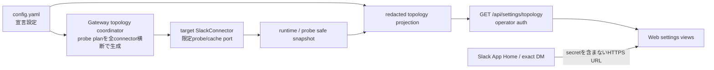

# Mana configuration visibility architecture

Story: `story-mana-configuration-visibility`

ADR: [`0005-read-only-configuration-topology`](../adr/0005-read-only-configuration-topology.md)

## Decision

Manaの設定可視化は、既存の編集用 `GET/PUT /api/config` とは分離した
`GET /api/settings/topology` の読み取り専用projectionとして実装する。
projectionはSlack connector、meeting-router、通常配送先、共有配送先を明示的な
allowlist schemaへ写像し、token、credential、環境変数名・値、生のconfig断片を返さない。

Webの正規入口は `/settings/topology`、Slack側の正規入口はApp Homeとする。
Bot DMでは `設定`、`mana設定`、`ルーティング`、`接続状態` の完全一致だけを、
`respondTo.im: never` より前に処理する。ただし `allowFrom` の認可より後で処理し、
LLM/sessionを起動しない。Slackが返すURLにはoperator tokenやsecretを含めず、
Web側は既存のoperator認証を独立して要求する。

## Context and gap

- 旧manaからmana-runtimeへの移行で、クロスworkspace共有の設定と実行状態が
  運用者から見えなくなった。
- meeting-routerの宣言設定、connectorの稼働状態、Slack上のworkspace/channel、
  通常配送と共有配送が別々に存在し、誤配送時に期待経路と実効経路を比較できない。
- 現行Web Settingsは設定編集を担う。運用確認画面から編集処理へ到達できると、
  調査中の誤変更とsecret露出のリスクが増える。

## Read model

projectionは次の3層を区別する。

1. `declared`: configに宣言されたID、名称、respond policy、route。
2. `runtime`: 起動中connectorのhealth、認証済みworkspace ID、観測時刻。
3. `verification`: 宣言値とruntimeの照合結果。観測不能は `unconfirmed` と理由を返す。

### API shape

- `schemaVersion`, `observedAt`
- `connectors[]`: instance ID、employee、workspace ID、health、respond policy、
  allowlisted operator数、設定入口の有効状態
- `routes[]`: `primary` / `share`、source connector/router channel、project、
  destination connector/workspace/channel/name
- `warnings[]`: stable code、severity、対象ID、安全な説明
- `history[]`: `ts`、`source`、`file`、`operatorAuthenticated` だけを許可した履歴metadata。
  snapshot名・snapshot本文・raw configは含めない
- `summary`: connector/route/warningの件数。確認不能を0件やhealthyへ丸めない

Slack APIから名称・参加状態・archived・権限を確認できない場合は、設定上の名称とIDを
保持したまま `unconfirmed` とする。MVPではgatewayがtop-level/named connectorのlive configを
横断してprobe planを生成する。router/通常配送先は宣言元connectorへ、`shareDestinations` は
`connectorInstanceId` で解決したtarget connectorへ割り当てる。全connector生成後、connector再起動後、
設定reload後にtarget connectorの限定probe/cache portへplanを渡し、名称、Bot参加、archived、権限、
`checkedAt` をsafe snapshotへcacheする。reload時は旧plan/cacheを先に無効化し、削除済みchannelの
観測値を残さない。target connectorを解決できない項目はprobeせず
`error/target_connector_missing` とする。
HTTP request中に外部Slack APIを連鎖させず、projectionは最後のsnapshotだけを読む。
probe失敗時は直前の成功値をhealthyとして再利用せず、`unconfirmed` とstable reason、
失敗した確認時刻を返す。これにより画面表示をSlack API障害から分離しつつ、AC-07/08を
MVP内で満たす。

Socket Modeの `error`、`reconnecting`、`disconnected` はtransport障害として直前のprobeを
即時無効化し、secretを含まない `slack_runtime_unavailable` と障害観測時刻だけをsnapshotへ
投影する。`connected` 後は最後のprobe planを再実行し、成功したchannelだけを再びverifiedへ
戻す。Boltの単発handler errorはtransport切断と同一視せず、health/cacheを変更しない。
いずれのruntime errorもraw/formatted detailをlogへ出さず、stable codeとinstance IDだけを残す。

## Web information architecture

- `/settings/topology`: 全体マップと警告
- `/settings/connectors/slack`: connector/workspace状態
- `/settings/meeting-minutes`: 通常配送と共有配送
- `/settings/permissions`: allowlistとrespond policy（ID一覧は表示せず件数のみ）
- `/settings/history`: 現在の観測時刻とtopology response内のallowlist済みconfig履歴metadata。
  既存 `/api/config-history` は使用しない

各routeは `workspace`、`project`、`channel` query parameterを受け、該当カードを
選択・強調する。未知の値は無視し、データを拡張して返さない。全画面はread-onlyで、
保存・適用・修復buttonやmutation requestを持たない。

## Authentication and URL contract

- `settingsHome.webBaseUrl` は固定HTTPS originを設定する。localhostは開発時だけ許容する。
- Slack button URLは `${webBaseUrl}/settings/topology`。query parameterは識別子だけで、
  bearer credential、operator token、Slack tokenを含めない。
- topology APIはplacement有無にかかわらず既存operator credentialの検証を無条件に要求する。
  endpoint先頭の専用guardで `operatorAuthorized(req)` を評価し、placement delegation token、
  internal notification credential、無credentialを拒否する。既存generic placement gateへ委譲しない。
  未認証時はprojectionを返さない。Webは同じroute上にpassword型credential promptを表示し、
  現行 `storeOperatorToken` でbrowser localStorageへ保存後、現在のpathとqueryのまま再取得する。
  tokenはURL/query/logへ入れない。401/403時はdata cacheを消去しpromptへ戻す。
- Slack App Home/DMの設定入口はconnectorの明示的な `allowFrom` を必須とする。
  `allowFrom` が未設定または空の場合もfail-closedとし、構成概要やbuttonを出さない。
  これは既存の一般message処理が持つopen semanticsを変更しない、設定入口だけの境界である。

## Slack interaction contract

- `app_home_opened` でApp Homeをpublishする。URL未設定時は「未設定」としbuttonを出さない。
- exact DM commandは前後空白を除いて完全一致する場合だけshortcutを返す。
- shortcut判定は `ignoreOldMessagesOnBoot` のtimestamp/replay抑止より後に置く。古いeventは
  shortcut、postMessage、通常handler、session、LLMのいずれも起動しない。
- shortcutは通常message handler、triage、session、LLMを呼ばない。
- 一般DMは従来どおり `respondTo.im` に従う。
- manifest/operator手順でApp Home tabと `app_home_opened` eventを有効化する。

`packages/web/src/lib/slack-manifest.ts` のgenerated manifestと
`docs/operations/slack/mana-pilot-business-operations.app-manifest.json` のstatic manifestは、
既存のSocket Mode、messages tab、assistant view、scopes/events、`/vibepro` を保持したまま、
App Home tabと `app_home_opened` subscriptionを追加する。connectorの `/ryoko-develop` handlerは
変更しないが、現行manifestに存在しないcommandをこのStoryで新規追加しない。

## Error deep-link contract

meeting-minutesの配送失敗、共有失敗、workspace不一致、Bot未参加、archived、権限不足を
生成する側が、安全なURL builderで `/settings/meeting-minutes` または
`/settings/connectors/slack` へのlinkを付与する。queryは既知の `workspace`、`project`、
`channel` IDだけを `URLSearchParams` でencodeし、token、raw error、任意URLを受け取らない。
URL未設定時は従来の安全なerror textだけを返す。Webのquery受信側とerror producerの双方を
contract testで固定する。

## Failure and observability

- connector snapshotなし: `unconfirmed/runtime_snapshot_unavailable`
- target connectorなし: `error/target_connector_missing`
- workspace不一致: `error/workspace_mismatch`
- channel metadata取得成功かつactive/member: `verified/channel_ready_by_static_checks`
- Bot未参加: `error/bot_not_member`
- channel archived: `error/channel_archived`
- `conversations.info` が `missing_scope` / `not_allowed_token_type` を返す: `error/permission_denied`
- channelが見つからない: `error/channel_not_found`
- Slack API timeout/5xx/分類不能error: `unconfirmed/slack_probe_failed`
- URL未設定: Slackではbuttonなし、API warningは `settings_url_unconfigured`
- raw error textはAPIへ転送しない。logにはstable codeとinstance IDだけを記録する。

ここで「権限」はread-only probeに必要なchannel metadata読取能力を指す。投稿可否を確認する
ためのtest messageは送らない。`channel_ready_by_static_checks` はconnector running、workspace一致、
metadata読取成功、active、Bot memberを満たす静的準備状態であり、実配送成功の証明ではない。

`observedAt` はprojection生成時刻であり、Slack外部状態の最終確認時刻とは分ける。
各verificationは `checkedAt` と `verified | error | unconfirmed` を持つ。

## Consequences

- 運用者はWebとSlackから同一の安全な経路図を確認できる。
- projection schemaを追加保守する必要があるが、config schemaの追加項目やsecretが
  意図せずブラウザへ流れることを防げる。
- MVPはconnector health、認証済みworkspace、名称、channel参加、archived、権限を
  非同期probe cacheから表示する。確認不能は `unconfirmed` として明示する。

## Release operations

### Release note and owner

Release ownerはManaの当番運用者とする。release noteには、この変更が設定の読み取り専用表示と
Slackからの導線を追加するものであり、設定の編集、保存、配送先変更を行わないことを明記する。
また、通常配送とクロスワークスペース共有を別経路として表示すること、live productionの成否は
PR内のmock/E2Eでは確定せず、deploy後のR-01〜R-03で判定することを記載する。

### Rollout plan

1. Release ownerが対象artifact、固定HTTPS origin、operator credentialの供給元、対象Slack Appと
   workspaceを記録し、Jimmy GatewayとWebを同一releaseとして反映する。
2. 書き込み操作をせず、認証なしの保護APIが本文を返さないことと、認証済みGETがsecretを除外した
   topology projectionだけを返すことを確認する。
3. Web sidebar、App Home、明示的な設定DM、実エラー通知から対象画面へ到達し、R-01〜R-03を
   時刻、workspace、route kind、stable status codeとともに記録する。token、raw config、raw errorは
   証跡へ保存しない。
4. R-01〜R-03の全件が確認されるまでrelease statusを `未確認` のままにする。不一致があれば
   Slackへの案内を拡大せず、rollbackへ進む。

### Rollback instruction

本変更はschema migrationを伴わない。失敗時はRelease ownerがJimmy GatewayとWebを直前の
review済みartifactへ同時に戻し、Slack App manifestから既存機能を削除せず、追加したApp Home導線と
event subscriptionだけが旧artifactの状態へ戻ったことを確認する。設定値を空にする、operator認証を
外す、placement/allowlistを緩和する操作をrollbackとして使わない。rollback後は保護APIの拒否、
既存 `/settings`、既存meeting-minutes配送を再確認し、結果を `rollback_verified` または `未確認` として
記録する。直前artifactへ戻せない、または既存配送が確認できない場合はconnectorを停止したまま
incident ownerへ引き継ぐ。

### Owner-visible observability evidence

Release ownerが確認できるrelease recordへ、artifact identifier、production HTTPS originの識別子、
確認者、確認時刻、R-01〜R-03それぞれの `verified | error | unconfirmed`、通常配送と共有配送の
route kind、stable status code、rollback要否を残す。スクリーンショットまたは構造化probe結果を
添付できるが、operator token、Slack token、raw config、message本文、raw errorは含めない。
`observedAt` はprojection生成時刻、`checkedAt` は外部状態の確認時刻として区別する。
このowner-visible evidenceがない限り、HTTP 200、process起動、merge、deployだけではrelease完了としない。

## Verification

- projection unit test: primary/shareの区別、欠落connector警告、secret非露出
- API contract test: placementあり/なしの双方でoperator認証必須、GETのみ、mutation routeなし、
  未認証・placement delegation・internal notification credentialの拒否後にprojection bodyを返さず、
  正しいoperator credentialだけを許可する。既存legacy APIのplacement未設定時挙動は変更しない
- Slack tests: top-level/named connector双方のApp Home、exact DM例外、古いeventのsilent drop、一般DM silence、
  allowFrom未設定/空/対象外/許可、handler停止時のshortcut、URL・logへのsecret非露出
- probe coordinator tests: top-level sourceからnamed targetへのshare probe割当、target欠落、
  reload時の旧cache破棄、HTTP request中のSlack API呼出しゼロ
- history tests: placements有無にかかわらないoperator認証、allowlist metadataだけのschema、
  snapshot本文・snapshot名・raw config・secret非露出
- Slack manifest tests: App Home/event追加と既存Socket Mode/commandの維持
- error producer tests: 配送・共有・権限errorが安全なdeep linkを生成する
- Web tests: loading/error/empty、query deep link、5つの導線、既存 `/settings` 到達性、
  sidebar単一active、mobile導線、mutation requestなし
- E2E/manual evidence: App Home、DM、sidebar、実error通知の4入口、credential保存後の同route再取得、2操作以内、
  320px mobile、keyboard/screen reader labelを現在のbuild/HEADへ紐付ける
