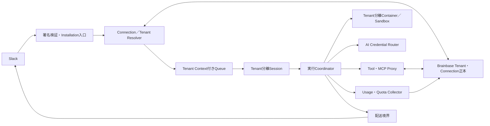

# 八雲まなマルチテナントランタイムアーキテクチャ

## 対応Story

- [八雲まなをテナント分離されたSlackランタイムとして提供する](../management/stories/active/story-mana-multitenant-runtime.md)
- [SlackからBrainbaseまでテナントを越境せず完了する](../management/stories/active/story-slack-mana-brainbase-multitenant-e2e.md)
- Brainbase側: `Unson-LLC/brainbase-unson:story-brainbase-multitenant-platform`

## 決定

mana-runtimeはSlackイベントを受けた後、Brainbaseのworkspace connection正本からcanonical tenantを解決し、検証済みtenant contextを全実行境界へ伝播する。Slack workspace、channel、placement、表示名はルーティング材料でありtenantの正本ではない。

共有Cloudflare、専用配置、顧客管理配置は同じ外部契約と否定テストを持つ。物理分離の差は明示するが、認証、認可、tenant context、credential、冪等性、Receiptの意味を変えない。

## 責務分担

| 領域 | Brainbase | mana-runtime |
|---|---|---|
| canonical tenant | 正本 | 解決結果を検証・伝播 |
| workspace connection | 正本、revision、失効 | installation連携、eventとの照合 |
| contract・quota | 正本と判断 | 実行前適用、利用者向け表示 |
| credential | mode、秘密値、更新、失効の唯一の正本。opaque参照と単回leaseを発行 | opaque参照を要求し、実行境界へ60秒以下で限定注入 |
| Slack event・reply | 対象外 | 受信、実行、最大1回配送 |
| session・file・Container | 対象外 | tenant分離と破棄 |
| usage・Receipt | contract、quota、canonical UsageEvent、OperationReceipt、business-effect ledgerの正本 | queue実行claimとSlack delivery claimを持ち、実消費と結果を相関ID付きで報告 |

## 論理構成

## Tenant Contextの流れ

1. Slack入口で署名、app、workspace、eventを検証する。
2. installationからBrainbaseのworkspace connectionを一意解決する。
3. Brainbaseがcanonical snake_caseの`TenantContextEnvelope`を発行する。mana-runtimeはRFC 8785 JCSとEd25519 detached JWS、TTL 300秒以下、clock skew 30秒以下を検証し、内容を変更・延命しない。
4. Queue、Session、Container、MCP、Brainbase proxy、Slack deliveryの各境界でcontextと現行revisionを再検証する。
5. 実行結果と実消費を同じcorrelationへ結び、Brainbase Receiptへ報告する。
6. delivery scopeを再検証し、元のtenant、workspace、channel、threadへ最大1回返信する。

contextが欠落、曖昧、改ざん、失効、古い場合はその場で停止する。default tenant、別placement、別project、別credentialへ補完しない。

## 信頼境界

- Slack payloadは外部入力であり、tenant主張を信頼しない。
- Queue messageは署名済みでも再検証する。Worker、Queue consumer、Durable Object、Container、MCP、Brainbase proxy、Slack deliveryの全境界が同じ検証規則を使う。
- Durable Object／session cacheは正本revisionより弱い。
- AIモデル、生成コード、tool引数は非信頼入力として扱う。
- ContainerとSandboxは認可判断を行わず、検証済み能力だけを受け取る。
- tool／MCP proxyは実行直前にtenant、project、capabilityを再検証する。
- Slack deliveryはallowed delivery scopeと元eventを再照合する。

## 実行分離

すべての内部キーはtenantを最上位境界に置き、その下でworkspace、channel、thread、session、operationを区別する。同名workspace、channel、user、projectでもtenantが違えば同じkey、cache、object、sessionを共有しない。

別tenantへのContainer再利用は常に禁止し、tenant変更時は必ずdestroyする。同一tenantでの再利用だけを、未失効のoperation lease、全子process停止、workspace／tmp／home削除、environment allowlist再構築、credential mount解除、transcript／session／cache削除、未承認open handleなし、同一tenantのfreshな署名済みcontextを満たす場合に許可する。全checkを含む除染Receiptを発行できない場合もdestroyし、`CONTAINER_SANITIZATION_UNPROVEN`で停止する。

添付ファイルと一時objectはtenant scope、size／MIME制限、保持期限、削除証跡を持ち、URLやsecretをモデルへ直接渡さない。

## AI Credential Router

Brainbaseが返す契約revisionとcredential modeから、Cloud標準API、顧客OAuth、顧客APIのいずれかを決定論的に選択する。Brainbaseだけがcredential本文とrefreshを所有する。mana-runtimeは`credential_ref`からtenant、connection、revision、operation、audience、credential modeへ束縛された単回leaseを取得し、60秒以下のtrusted volatile injectorだけへ渡す。秘密値をQueue、Durable Object、モデル、tool、disk、log、fixture、Receiptへ渡さない。

認証失敗、更新競合、失効、scope不足では、別mode、運営者credential、別tenantへfallbackしない。顧客credential利用時の課金主体も同じ契約revisionから決まり、推測しない。

## Sessionと冪等性

sessionはtenant、workspace、channel、threadで分離し、connectionまたは権限revisionが変われば安全なepochへ切り替える。再送はprotocol、tenant、connection、Slack event、operationから生成する固定idempotencyとして扱い、Brainbase writeとSlack replyには同じcorrelation配下の別operation IDを与えてそれぞれ最大1回にする。claimは`pending`、`claimed`、`succeeded`、`failed_terminal`を持ち、terminalを30日以上保持する。

失敗後のretryは同じidempotency keyを維持する。入口で解決したrevisionは、credential lease、Brainbase write、Slack deliveryの直前に正本へ再照会する。cacheは最大30秒とし、eventは無効化hintにしか使わない。revisionが変わった場合はfresh contextへ再解決し、古い権限のまま続行しない。

## 利用上限・原価

AI token、model、tool、MCP、Container時間、storage、retryをcorrelationとtenantへ帰属させる。Brainbaseのrevision付きcontract判断`allowed`、`warning`、`hard_stopped`、`approval_required`、`unavailable`と、超過方針`deny`、`allow_and_bill`、`allow_with_approval`に従い、Tenant Aの上限をTenant Bへ波及させない。閾値はbasis pointsで正本から受け、runtime既定値で補わない。

失敗した実行の消費も記録する。`collection_state=collected|partial|not_collected`と`outcome=succeeded|failed|cancelled|timed_out`を別軸にし、未取得を0消費へ変換しない。取得済み0件は`outcome=succeeded`、`collection_state=collected`、`observed_units=0`、`failure_code=NO_DATA`とする。Slackには内部契約やcredentialを漏らさず、再認証、管理者確認、再試行など次の行動を示す。

## 配置profile

| profile | 分離 | 契約 |
|---|---|---|
| `shared_cloud` | tenant単位の論理分離 | 全境界で共通契約を強制 |
| `dedicated_cloud` | tenantまたは契約単位の物理分離を追加 | sharedと同じ外部契約 |
| `customer_managed_oss` | 顧客管理の実行環境 | 同じtenant／connection契約、任意機能差だけを理由付き`non_applicable`で明示 |

配置固有の特権を暗黙に付与しない。配置変更時もtenant、connection、idempotency、Receiptを維持する。

## Protocol互換性

protocol IDは`mana-brainbase-tenant-context`、現行versionは`1.0`、互換範囲は`>=1.0 <2.0`とする。相互に対応する最高minorを選び、majorまたは必須capability不一致はdowngradeせず拒否する。必須capabilityは`signed_tenant_context`、`connection_revision_recheck`、`tenant_scoped_authorization`、`credential_broker_v1`、`usage_receipt_v1`、`idempotent_effects_v1`、`container_sanitization_v1`である。deprecated minorは90日以上の移行期間を持つ。

Cloudと互換OSSの両方で、tenant context、署名／時刻、revision、認可、credential scope、分離、冪等性、failure semantics、Usage／Receipt、no-fallbackを必須とする。任意capabilityだけが理由付き`non_applicable`になり得る。暗黙のdowngradeとfallbackは禁止する。

## 現行Cloudflareからの移行

既存のworkspace、channel、placement bindingは削除せず、canonical tenantとworkspace connectionへ明示的に結び直す。移行済みでないbindingはdefault tenantへ流さず隔離する。単一credential前提は共有実行経路から段階的に除去し、旧runtimeとの二重配送を発生させない。

## 障害の意味

| 状態 | 振る舞い |
|---|---|
| connection not found／ambiguous | LLM前に拒否 |
| revoked／stale revision | cacheを使わず拒否 |
| scope／placement mismatch | 他経路へfallbackせず拒否 |
| credential unavailable | modeを変更せず再認証または管理者対応を案内 |
| quota exceeded | 当該tenantだけ停止 |
| upstream unavailable／partial | 0件や成功へ変換しない |
| retry exhausted | 二重write・replyを防いで失敗確定 |

## 受入条件との対応

| 受入条件 | Architecture上の保証 |
|---|---|
| `AC-001` | installationをBrainbase workspace connectionへ登録する。 |
| `AC-002` | app、workspace、enterprise、installer、scope、revision、statusを入口で照合する。 |
| `AC-003` | 再認証、scope変更、uninstall、失効をrevisionとして扱う。 |
| `AC-004` | connection異常をLLM前にfail closedにする。 |
| `AC-005` | token本文をcontext、Queue、session、Container、ログ、Receiptへ含めない。 |
| `AC-101` | Brainbase正本からcanonical tenantを解決する。 |
| `AC-102` | 型付きtenant contextを全経路へ伝播する。 |
| `AC-103` | 各実行・tool・delivery境界で再検証する。 |
| `AC-104` | 異常時のdefault tenant／placement fallbackを禁止する。 |
| `AC-105` | tenant・event・operation単位の冪等性を維持する。 |
| `AC-201` | session、file、cache、workspace、MCP、secretをtenantで分離する。 |
| `AC-202` | 別tenantへのContainer再利用を禁止し、同一tenant再利用前の完全除染とReceiptを要求する。 |
| `AC-203` | `shared_cloud`、`dedicated_cloud`、`customer_managed_oss`の共通必須契約を明示する。 |
| `AC-204` | 同時処理、同名識別子、retry、再利用をnegative fixtureにする。 |
| `AC-205` | 添付にscope、制限、期限、削除証跡を持たせる。 |
| `AC-301` | 契約revisionからcredential modeを決定する。 |
| `AC-302` | opaque handleと実行時限定注入を使う。 |
| `AC-303` | Brainbaseが所有するOAuth更新・失効・競合をtenant単位で監査し、mana-runtimeは結果だけを適用する。 |
| `AC-304` | 認証失敗時のmode／tenant fallbackを禁止する。 |
| `AC-305` | 単一credential前提を共有経路から除去する。 |
| `AC-401` | 全消費をcorrelationとtenantへ帰属させる。 |
| `AC-402` | Brainbase planのwarning／hard stop／超過判断を適用する。 |
| `AC-403` | quotaの影響を当該tenantへ限定する。 |
| `AC-404` | 失敗消費と未計測状態を保持する。 |
| `AC-405` | 内部情報を隠し、次の行動をSlackへ返す。 |

## Architecture fixture

- positive: 契約済みinstallationが正しいtenant、connection revision、credential mode、projectで1回実行・返信される。
- negative: Tenant A/B同時実行、同名識別子、改ざんcontext、失効connection、Container再利用、retryで越境と二重処理を拒否する。
- non-applicable: `customer_managed_oss`で任意のCloud運用capabilityが提供されない場合、理由付き非対応として扱う。必須contractとcredential modeは緩和せず、別credentialへ切り替えない。

## Specへの拘束

Specはcontextの検証点、partition、Container除染、credential選択、quota、usage、idempotency、deliveryの観測可能な振る舞いを具体化する。単一workspaceや単一secretをtenant代用にする仕様は認めない。

## 非目標

- Brainbase tenant schemaと契約正本の内部実装
- Slack Marketplaceへの一般公開
- 顧客ごとの価格決定
