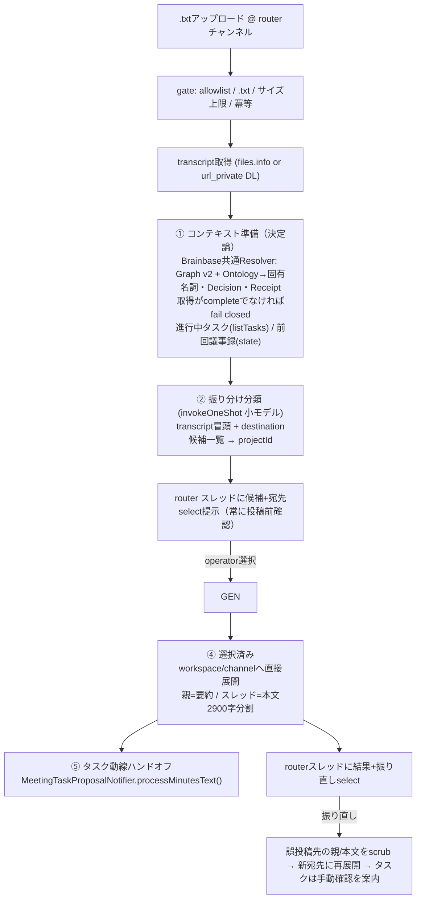

# Meeting minutes pipeline architecture（transcript着信→振り分け→議事録生成→展開）

## Decision

transcript(.txt)がSlackのrouterチャンネル（本番: `9940-meeting-router` C08SYTDR7R8）へ
アップロードされたら、LLMは振り分け先プロジェクトを**候補として提示**し、operatorが
確定した後だけ議事録を生成してプロジェクトチャンネルへ展開する。展開後は既存の `MeetingTaskProposalNotifier`（柱4、
`story-meeting-task-proposal.md`）へ直接ハンドオフし、タスク自動登録まで一気通貫にする。

3系統の統合方針（operator承認 2026-07-30）:

- **正はmana-runtime**。本storyの実装が唯一のrunner。
- **Eve（brainbase-eve-agents）は設計ドナー**。`apps/meeting-agent/agent/instructions.md` の
  Meeting Minutes Quality Contract（narrative_minutes.v1）と6段DAG構成を移植する。
  runnerとしては復活させない。
- **mana Lambdaは移植完了後に凍結**。コードは移植しない（参照実装:
  `processFileUpload.js` / `channel-selection-service.js` / `llm-integration.js`）。

DAGの実行はLLM任せにせず**決定論的コードで段を直列制御**し、LLMを呼ぶのは
振り分け分類と議事録生成の2段のみ（`shared/oneShotCli.ts` の `invokeOneShot`）。
brainbase側DAG設計（`meeting-note-generation-dag-wiring-architecture.md`）から
source_text_hash記録・**状態の単調遷移**・best-effortディスパッチの原則を引き継ぐ。

manaからの主な設計変更:

| mana現行 | 本設計 | 理由 |
|---|---|---|
| 全チャンネルの.txtで発火（フィルタなし） | routerチャンネルallowlistのみ（fail closed） | 誤発火と二重動作の排除 |
| プロジェクトは毎回ユーザーが全件からボタン選択 | LLM分類は候補提示のみ→operatorが宛先確定 | LLMの過信による誤配送を投稿前に止め、config正本1系統へ収斂 |
| 固有名詞辞書が2箇所に不整合ハードコード、Graph不達で辞書消失 | Brainbase共通Entity Resolver（Graph v2 + Ontology）で解決し、portable Receiptを保存。取得がcompleteでなければ生成を止める | 解決規則を会議処理へ個別実装せず、Brainbase全体の正本と監査契約へ統合 |
| `summarizeText`×2 + `generateMeetingMinutes`×2 の重複LLM呼び出し | 生成は1回、結果を投稿・タスク抽出へ共有 | コストとレイテンシ |
| 状態はLambdaプロセス内Map + action.value 1900字 + Slack再DLの3重補償 | `${JINN_HOME}` 配下のstateファイル（単調遷移） | gateway再起動に耐える単一の正 |
| タスク承認UIは独自実装（NocoDB行き） | 既存 `MeetingTaskProposalNotifier` へ直接ハンドオフ（正本=Canonical Task） | 実装1本化。register-first動線は稼働実績あり |

スコープ外: GitHubへのtranscript/minutesコミット（議事録はSlack、タスクは
正本ストアに残る。必要になったら別story）、カレンダー会議同定、決定事項抽出
（Graph decisions書き込み）、フォローアップメッセージ起草。クロスワークスペース宛先も
投稿前selectへ統合し、選択したworkspaceのexact connectorへ一度だけ直接配送する。

## DAG構成（Eve設計の写像）

Eveの6段のうちv1で移植するのは①②③⑥。④決定候補・⑤フォローアップは後続。



各段は state の `status` を単調に進める:
`received → routed → generated → posted → tasks_dispatched`（`failed:<stage>` は
どの段からでも入れるが、後戻りはしない。再試行は失敗した段からの再開）。

## Current reality

- mana-runtime SlackConnector はSocket Mode。connector本体の `app.message` は
  `bot_id` 付きとファイル添付を素通しにするが本処理はしない。本機能は
  `meeting-task-proposal.ts` と同型の**独自 `app.message` リスナー**を登録する。
  添付DLは `format.ts` の `downloadAttachment` を再利用。
- `MeetingTaskProposalNotifier` はメッセージイベント経由でしか動けず、しかも
  Boltの `ignoreSelf` により**自botが投稿した議事録は見えない**。よって本機能からの
  ハンドオフはSlackイベント経由ではなく、公開メソッド
  `processMinutesText(channel, ts, text)` を新設して**直接呼ぶ**（イベントゲートは
  バイパスするが、既存のstate冪等・register-first・取り消し/編集UIはそのまま使う）。
- `invokeOneShot` はプロンプトを**argv 1引数**で渡す。Linux（pilot）の
  MAX_ARG_STRLEN=128KiB により、長文transcript（日本語10万字≒300KB）は
  E2BIGで確実に失敗する。議事録生成段のために**stdin渡しオプション**を
  `oneShotCli.ts` へ追加する（`claude -p` は引数プロンプト省略時にstdinを読む。
  codex engineはstdin対応が異なるためv1はclaude engineのみサポート）。
- Graph SSOT API（`/api/info/graph/entities?type=<t>`）で person / project /
  brand / decision が読めることを実確認済み（2026-07-30、bb.unson.jp）。
  `shared/brainbase-graph.ts` は person 専用なので汎用entity取得へ拡張する。
- channel→projectの対応の正本は `~/workspace/common/meta/slack/channels.yml` だが、
  mana側にはS3ミラー・コード埋め込みfallback・overridesの計4系統があり
  **内容が矛盾している**（例: C0A2L9FEKEJ が resolver では proj_mana、ymlでは
  proj_dialogai）。mana-runtimeはこれらを参照せず、**pilot configの
  `destinations` リストを実行時の正**とする（エントリはchannels.ymlから
  人手で転記。将来Graph SSOTのproject entityへ吸収するのが柱2の拡張点）。

## Trust boundaries

- **発火**: `meetingMinutesPipeline.routerChannels`（チャンネルIDのallowlist）が
  未設定・空なら機能全体が停止（fail closed）。ゲート順: enabled → routerChannels →
  boot時刻より古いイベント除外 → `subtype: file_share` かつ `.txt`（小文字比較）→
  ファイルサイズ上限（既定1MB）→ 冪等チェック。複数添付は先頭の.txtのみ
  （mana同様。2件目以降はwarnログ）。
- **自bot・mana bot対策**: Boltの `ignoreSelf` が自bot投稿を除外。mana botは
  発火条件が同じ「.txtアップロード」かつ**manaにはチャンネルフィルタが無い**ため、
  同居チャンネルでは必ず二重動作する。運用手順として**mana botをrouterチャンネル
  およびE2EテストチャンネルからleaveさせてからこのパイプラインをONにする**
  （Release手順に明記）。コード側の防御として、transcriptアップロード者が
  botの場合も処理は続行するが、routerチャンネルに他のfile処理botが残っていないか
  はデプロイ前チェックリストで確認する。
- **発火allowlist**: `routerChannels` の `"*"` は設定エラーとして機能全体を停止する。
- **振り分け**: LLM分類の出力は `destinations` のprojectId enumに限定して
  バリデートする（listにないIDは「判定不能」扱い）。候補内IDでも配送権限にはせず、
  routerスレッドでoperatorが明示確定するまで生成・投稿しない。
- **別workspace直接配送**: 既存 `shareDestinations` は互換のため投稿前の宛先候補へ正規化する。
  action payloadはrun keyとopaqueなdestination IDだけとし、現在のconfigから
  `connectorInstanceId + workspaceId + channelId` を再解決する。target connector不在、
  `auth.test`のworkspace不一致、bot非所属、archive済みはすべて投稿前にfail closed。
  source connectorへのtoken/client fallbackは禁止し、生transcriptは配送しない。remote宛の
  タスク提案はsource tokenへfallbackせず安全にskipする。投稿後の「別workspaceへ共有」UIは出さない。
- **操作権限**: 振り直しselect・宛先selectの操作は `operatorUserIds`
  （未設定時は connector の `allowFrom` にフォールバック。どちらも空なら機能停止）
  のユーザーのみ。認可外はephemeralで拒否。`meeting-task-proposal` の
  `ApproverResolver` と同じ抽象（将来Graph RACIへ差し替え）。
- **冪等**: state key は `router:<channelId>:<fileId>:<ts>`。加えて transcript の
  `source_text_hash`（sha256）を記録し、**同一hashのtranscriptが処理済みなら
  スキップ**（同じ録音の再アップロードによる二重展開防止。brainbase DAG設計の継承）。
- **サニタイズ**: LLM由来テキスト（議事録本文・要約・タイトル）はSlack投稿前に
  既存 `sanitize()` 同等の防御（制御文字除去。ただし議事録本文はmrkdwn整形を
  保持する必要があるため `<>` 除去は `<@`/`<#`/`<http` のメンション・リンク構文
  のみを無害化する専用サニタイザにする — @channel ping と偽装リンクの防止が目的）。
- **固有名詞・Decision解決**: hosted GraphをGraph v2へ写像し、
  `@unson/brainbase-mcp` の共通Entity Resolverへ全文、project scope、as-ofを渡す。
  会議固有のalias scoringや名前マッチは持たない。`source.status=complete` かつ
  `resolutionStatus!=blocked` の場合だけ生成へ進み、portable Receiptを実行stateへ保存する。
  partial / unavailable / invalid は空結果へ丸めず `failed:brainbase` とする。

## Data

- 実行state: `${JINN_HOME}/.meeting-minutes-runs.json`
  - key: `router:<channelId>:<fileId>:<ts>`
  - value: `{ routerChannelId, fileId, sourceTs, fileName, sourceTextHash,
    status, projectId?, suggestedProjectId?, routingReason?, destinationChannelId?,
    postedParentTs?, postedThreadTs?, shares?, controlTs?, brainbaseResolutionReceipt?,
    minutes?{title,overview,body}, createdAt, updatedAt, expiresAt }`
  - 生成済み議事録（title/overview/body）はTTL内stateに保持する。振り直しを
    再生成なしで決定論的に行うため（本文はSlackに公開済みの内容であり機密性は
    transcriptと異なる）
  - TTL 14日（振り直しは議事録の有効期間内に起きる想定。期限切れ操作は
    ephemeralで案内）。`status` は単調遷移のみ許可。
  - `lastMinutesByChannel: { <channelId>: { title, overview, postedTs } }` を
    同ファイルに併置（次回生成時の「前回議事録」コンテキスト。全文は持たない —
    stateファイル肥大防止と、要約+タイトルで文脈参照には足りるため）。
- transcript本体: `downloadAttachment` で一時ディレクトリへ保存し、処理後に削除。
  stateには残さない（機密+サイズ）。hashのみ記録。
- コンテキスト入力:
  - 固有名詞・Decision: Graph person/org/project/decisionをproject scope付きで取得し、
    共通Entity Resolverが文字起こし全文から解決。Graph取得はcomplete必須
  - 進行中タスク: `BrainbaseTaskClient.listTasks({status})` から
    pending/in_progress を最大20件（タイトルのみ）
  - 関連Decision: Graph上のproject関係でscopeし最大10件。本文の名前包含による
    会議固有検索は行わない
  - 前回議事録: state の `lastMinutesByChannel[destinationChannelId]`
- LLM段のモデル既定: 振り分け分類= `claude-haiku-4-5`（enum選択タスク）、
  議事録生成= `claude-sonnet-4-6`（Quality Contractの物量要求。config上書き可）。
  生成timeout既定300s（transcriptは長い）。transcript入力上限12万字
  （超過は先頭優先で切り詰め+注記。manaの18万字より保守的にし、stdin渡しでも
  コンテキスト長と生成時間を抑える）。

## 議事録の品質契約（Eve narrative_minutes.v1 の採用）

生成プロンプトはEveの Meeting Minutes Quality Contract を移植する:

1. タイトル行 `<日付> <会議トピック>-要約`
2. 会議タイトル行
3. 概要2〜4段落（目的・主要テーマ・決定・未解決点）
4. トピックセクションを `------------` 区切りで並べ、各セクションは具体的な
   見出し+2〜5段落で**話の流れ（背景→議論→なぜ重要か→何が変わったか→未解決）**を保存
5. `アクションアイテム` セクション（担当者別。各項目=担当+内容+期限 or `[TBD]`）
6. 不確実性の保存: 担当不明=`@未確認`、期限不明=`[TBD]`、話者不明=`Speaker <n>`。
   **事実を捏造しない**。根拠不足のセクションは何が不足かを書く
7. 日本語transcriptには日本語で出力

パーサは決定論コードで検証する: タイトル行の形式、`------------` 区切りの存在、
アクションアイテムセクションの存在、最低文字数（transcript長に応じた下限は
モデルに会議長が分からないため廃止し、**固定の下限800字**のみ）。検証失敗は
1回だけ再生成し、それでも失敗ならfail（`failed:generate`、routerスレッドへ
再試行ボタン付きで通知）。

Slack投稿レイアウトはmanaの契約を維持する: **親メッセージ=概要（+タイトル）、
スレッド=本文を2900字境界で分割投稿**（Slack blockの3000字制限対応。分割は
改行→空白→強制の順で切断点探索）。

## Failure modes

- transcript DL失敗: `failed:download`。routerスレッドへ再試行ボタン付き通知。
- 振り分け結果（成功・失敗を問わない）: 自動投稿せずrouterスレッドに候補と
  宛先selectを提示。operator確定後にだけ続行する。
- 議事録生成失敗（検証NG含む）: 1回自動再生成→ `failed:generate`。routerスレッドに
  再試行ボタン。**transcriptは失われない**（Slack上のファイルが正本のまま）。
- 投稿失敗（宛先チャンネル未参加等）: `failed:post`。routerスレッドへ
  チャンネル名と共にエラー通知（botの宛先チャンネル招待はデプロイ手順に含める）。
- ハンドオフ失敗（タスク抽出・登録）: warnログ+routerスレッドに注記のみ。
  議事録展開は成功として扱う（タスク動線は既存UIの再試行で回復可能）。
- Brainbase Graph不達・部分取得・project scope不成立: Receiptへ状態を残して
  `failed:brainbase`。議事録は生成・投稿しない。タスクAPI不達と前回議事録不在は
  best-effortコンテキストとしてwarnし、Brainbase Entity Resolverがcompleteなら生成を続ける。
- gateway再起動: stateファイルで実行文脈は生存。処理途中（received/routed）で
  落ちた場合、再起動後の同一ファイル再アップロードは冪等キーが異なる
  （ts変化）ため再処理できる。自動レジューム はv1ではしない（要再アップロード。
  routerスレッドの失敗通知が案内する）。
- 振り直しの競合: 振り直しselect操作時にstateが `posted` 以降でなければ
  ephemeralで拒否。振り直しは「旧親と保存済みthread投稿を内容なしの移動表示へchat.update →
  新宛先へ再展開 → state更新」の順（削除はしない — 破壊的操作を避け、
  スレッドで既に会話が始まっていても壊さない）。旧宛先で登録済みのタスクは
  自動では触らず、「タスクは既存の取り消しUIから操作してください」と案内する
  （タスクの一括付け替えは誤爆リスクがreroute頻度に見合わない）。

## Deployment impact

- Slack App権限: 既存の `files:read`（添付DL実績あり）と Interactivity
  （柱4で有効化済み）で足りる。**新スコープ追加なし**。
- 起動条件: `BRAINBASE_GRAPH_API_BASE_URL`（task API URLへfallback可）と
  project-scoped `BRAINBASE_GRAPH_API_TOKEN` が必須。未設定なら機能全体を起動しない。
- botを振り分け先の各プロジェクトチャンネルへ招待する必要がある。
- pilot config (`~ryoko/.ryoko/config.yaml`) の `connectors.slack` に追加:

```yaml
meetingMinutesPipeline:
  enabled: true
  routerChannels: ["C0A2L9FEKEJ"]   # E2E中は9999-manaテスト。本番切替でC08SYTDR7R8
  destinations:
    - projectId: proj_test
      name: manaテスト
      channelId: C0A2L9FEKEJ
      github:
        owner: Unson-LLC
        repo: mana
        branch: main
        pathPrefix: docs/meetings
  # 旧shareDestinationsも投稿前のdirect destinationとして互換読込する
  shareDestinations:
    - shareId: proj-test-business
      projectId: proj_test
      name: 事業運営 / manaテスト
      connectorInstanceId: slack-biz
      workspaceId: T_TARGET_WORKSPACE
      channelId: C_TARGET_TEST
  # operatorUserIds: 省略時は allowFrom（佐藤）にフォールバック
  # generation: { model: claude-sonnet-4-6, timeoutMs: 300000 }
```

- gateway MCPツールは増やさないため、3層placementゲートの変更は不要。
- GitHub保存を有効にする各destinationには `github` を設定し、実行環境へ
  `GITHUB_TOKEN`（対象repoのContents read/write権限）を渡す。文字起こしは
  `<pathPrefix>/transcripts/`、議事録は `<pathPrefix>/minutes/` に保存される。
  保存に失敗した場合はSlackへ成功投稿せず、再試行で同じpathを更新する。
- そのほかの環境変数は既存の `BRAINBASE_TASK_API_BASE_URL/_TOKEN` と
  `BRAINBASE_GRAPH_API_TOKEN`（統合トークン `openryoko-pilot`、全project scope付き）
  をそのまま使う。**project scopeなしトークンはGraph読取が422/403になる罠**
  （柱4のDone evidence参照）に注意。

## Release and operator actions

1. **mana botのleave**: E2Eテストチャンネル `9999-manaテスト`(C0A2L9FEKEJ) から
   mana botをleaveさせる（manaは全チャンネルの.txtで発火するため必須。
   `/kick @mana` またはチャンネル設定から）。本番切替時は
   `9940-meeting-router`(C08SYTDR7R8) でも同じ手順。
2. Lightsail pilotで `git pull` → `packages/jimmy` で `npx tsc` →
   `sudo systemctl restart openryoko.service`。
3. E2E: `9999-manaテスト` へ実会議のtranscript(.txt)をアップロード →
   自動振り分け→議事録生成→同チャンネルへ展開（親=概要/スレッド=本文）→
   スレッドにタスク登録結果（既存register-first UI）→ bb.unson.jp正本で実在確認。
4. 振り直しselectの動作、認可外ユーザーの操作拒否、判定不能時の宛先select、
   同一ファイル再アップロードのhashスキップを確認。
5. 本番切替: configの `routerChannels` をC08SYTDR7R8へ、`destinations` を
   channels.ymlから実プロジェクト分転記。mana botをrouterからleave →
   **mana Lambda凍結**（EventBridge/トリガー無効化はmana側の別作業として記録）。

## Observability

- gateway: `journalctl -u openryoko.service` の `[meeting-minutes]` ログ
  （検知、hash、振り分け結果と根拠、生成時間・文字数、投稿先、ハンドオフ結果、
  認可拒否、各failed:段）。
- Slack: routerスレッドの制御メッセージ（振り分け先・状態・振り直しselect）が
  実行の可視化を兼ねる。
- state: `.meeting-minutes-runs.json` の status で全実行の現在地を確認できる。

## Rollback

1. config の `meetingMinutesPipeline.enabled: false` → gateway再起動で完全停止。
2. mana botを対象チャンネルへ戻せば旧フロー（Lambda）が即復活する
   （mana側は本件で一切変更しない）。
3. stateファイル削除で実行文脈を破棄可能（投稿済み議事録・登録済みタスクには
   影響しない）。

## Done evidence

- 実装(2026-07-30): `npx tsc --noEmit` 通過、vitest 81 files / 878 tests 全通過
  （新規41: generator 24 + pipeline 17）。実装物:
  - `connectors/slack/meeting-minutes-pipeline.ts` — DAG直列制御・stateマシン・
    振り直し/宛先select/再試行のBlocks UI
  - `connectors/slack/meeting-minutes-generator.ts` — routing/生成プロンプト・
    契約バリデータ・mrkdwn保持サニタイザ・2900字分割
  - `shared/oneShotCli.ts` — `promptViaStdin`（Linux MAX_ARG_STRLEN 128KiB対策）
  - `shared/brainbase-graph.ts` — 汎用 `GraphEntityClient`（person/project/brand/
    decision、type別5分キャッシュ）
  - `meeting-task-proposal.ts` — `processMinutesText()` 直接ハンドオフ経路
- pilot E2E成立(2026-07-30): pilotへデプロイし config
  （routerChannels=C0A2L9FEKEJ、destinations=proj_test）で起動確認。
  テストtranscript(.txt)をmana botとしてアップロード（mana Lambdaは自bot投稿を
  無視するためleave不要で二重動作を回避。leaveは本番切替時のみ必要）→
  50秒で全段完了: LLM振り分け（proj_test、判定理由もログに記録）→
  narrative_minutes.v1準拠の議事録生成（`-要約`タイトル・概要複数段落・
  `------------`区切りトピック・話の流れ保存・`@未確認`なしで担当者別
  アクションアイテム）→ 親=概要/スレッド=本文で展開 →
  `processMinutesText()`ハンドオフで2/2タスク自動登録（Graph解決済み担当者
  「星野 秀弥」「佐藤 圭吾」・期限2026-08-04/08-08 JSTを正本GETで確認）。
  同一ファイル再アップロードはhash一致でスキップされることも確認。
  振り直しselect・認可外拒否のSlack実機タップ検証は未実施（機能はunit test済み）。
