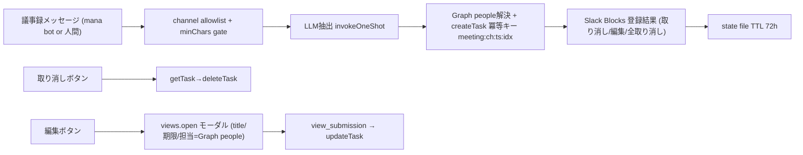

# Meeting task proposal architecture（議事録→タスク自動登録→取り消し/編集）

## Decision

議事録がSlackの許可チャンネルに投稿されたら、LLMでタスク候補を抽出して
**デフォルトでBrainbase Canonical Task（bb.unson.jp companion API）へ冪等登録**し、
Slack Blocksには登録結果と「取り消し」「編集」ボタンを提示する（register-first）。
当初は承認ボタンで登録するapprove-first設計だったが、operator決定(2026-07-30)で
「デフォルト登録・間違いは取り消し/編集」へ反転した。人間の仕事は確認だけ（柱3の思想）。

担当者は登録時にGraph SSOTのperson entities（name/aliases）から一意解決を試み、
解決できた場合のみ `assignee_person_id` を渡す（曖昧・不明は担当なし）。
「編集」はSlackモーダルで、タイトル・期限（datepicker）・担当者
（Graph peopleのstatic_select）を変更できる。**本機能がGraph実行時参照の
最初の実用例**（柱2）。

mana（Lambda版）の `meeting-flow-integration.js` を設計の正として mana-runtime の
Slack connector へ移植する。コードは移植せず、mana-runtime の既存慣行
（task-reminder のstate永続化、goal-extractor のLLM呼び出し分離）で再実装する。

スコープ: タスク（actions）のみ。manaが扱っていた決定事項（Graph decisions）と
課題（NocoDB）は登録先が異なるため対象外。

## Current reality

- mana側の承認フローは「.txtファイルアップロード」だけで発火し、チャンネル単位の
  停止スイッチがない（`processFileUpload.js` にallowlistなし）。登録先はNocoDBで、
  Canonical Task正本（bb.unson.jp）ではない。
- mana-runtime の SlackConnector は Socket Mode（`index.ts:138-142`）。block_actions
  ハンドラの前例はゼロだが、`app.action()` を登録するだけで受けられる。slash command
  `/ryoko-develop`（`index.ts:346`）が「3秒ack→認可→処理」の型。
- connector本体の `app.message` ハンドラは `bot_id` 付きメッセージを捨てる
  （`index.ts:420`）。mana botが投稿する議事録はここを通らないため、本機能は
  独自の `app.message` リスナーを登録する（Boltは複数リスナー可。自bot投稿は
  Boltデフォルトの `ignoreSelf` が除外する）。
- タスク登録は `shared/brainbase-tasks.ts` の `createTask(input, idempotencyKey)`。
  冪等キーを明示しないと毎回 `openryoko:<uuid>` になるため、決定的キーの明示が必須。



## Trust boundaries

- **発火**: `meetingTaskProposal.channels`（チャンネルIDのallowlist）が未設定・空なら
  機能全体が停止（fail closed）。ゲート順: enabled → channels → boot時刻より古い
  メッセージ除外 → `minMessageChars`（既定200字。議事録は長文）→ LLM抽出。
  抽出0件なら何も登録・投稿しない。
- **操作権限**: `approverUserIds`（未設定時は connector の `allowFrom` にフォールバック。
  どちらも空なら機能停止=fail closed）のユーザーのみ取り消し/編集可。認可外の押下・
  モーダルsubmitは拒否（押下はephemeral通知）。判定は `ApproverResolver`
  インターフェースに切り出し、初版は静的リスト実装。将来Graph SSOTのRACI解決実装へ
  差し替える（柱2の拡張点）。
- **二重登録防止**: 冪等キー `meeting:<channelId>:<sourceTs>:<index>`（決定的）。
  `api:`/`workflow:` 予約プレフィックスと衝突しない。登録失敗時は候補が `pending` に
  残り「登録を再試行」ボタンで同一キー再実行（二重登録なし）。
- **取り消しの安全弁**: 削除は不可逆なのでSlackのconfirmダイアログを挟む。削除は
  `getTask` で最新versionを取ってから `deleteTask(expected_version)`（楽観ロック）。
- **サニタイズ**: LLM由来のタイトル等は task-reminder と同じ `sanitize()`
  （制御文字・`<>` 除去）を通してからSlackへ出す。
- **担当者解決**: Graph person entitiesのname/aliasesと空白無視の完全一致のみ。
  複数マッチ（同姓など）・不一致は担当なしにフォールバック（誤った担当の正本登録の
  ほうが担当なしより害が大きい）。Graph不達時も担当なしで登録は続行（fail-open）。
  議事録記載の生の担当者名は常にdescriptionに残す。

## Data

- 提案コンテキスト: `${JINN_HOME}/.meeting-task-proposals.json`
  （manaのDynamoDB TTL 72hの置き換え。`ttlHours` 既定72、アクセス時に期限切れを掃除）
  - key: `<channelId>:<sourceTs>`（同一議事録の再処理防止を兼ねる）
  - value: `{ channelId, sourceTs, proposalTs, createdAt, expiresAt, candidates[] }`
  - candidate: `{ index, title, description, assignee, due, status: pending|approved|rejected, taskId? }`
- 期限切れ後のボタン押下は「期限切れ」をephemeralで返す（manaのblocks復元
  フォールバックは移植しない。復元は不完全で重複登録リスクがあるため）。
  期限切れ後の修正は正本タスクボード上で直接行う（タスク自体は登録済みで残る）。
- Graph読み取り: env `BRAINBASE_GRAPH_API_BASE_URL`（省略時はtask API base）と
  `BRAINBASE_GRAPH_API_TOKEN`。**task APIのbbsvcトークンにはproject scopeが無く
  Graphを読めない**ため、pilotにはmember role + 全project scopeの専用サービストークン
  `openryoko-pilot-graph` を発行して使う（発行はCEO bearer + CSRFトークンで
  `POST /api/auth/service-tokens`）。person一覧は5分キャッシュ。

## mana との二重動作防止

- manaの発火条件は「.txtファイルアップロード」、本機能は「メッセージ本文」のみ
  （ファイル添付メッセージはスキップ）。発火条件が重ならないため、同一チャンネルに
  両botが居ても同じイベントに二重反応はしない。
- ただしmanaのパイプライン末尾（議事録本文の投稿）に本機能が反応し、mana自身の
  提案UI（NocoDB行き）と併存する。初版はpilotのテストチャンネル
  `9999-manaテスト`(C0A2L9FEKEJ) のみをallowlistに設定して共存を観察する。
  実チャンネル展開時は、manaを止めるスイッチがコードに無いため
  **mana botを該当チャンネルからleaveさせる**（またはmana側 `processFileUpload.js`
  にチャンネルガードを追加する）のが停止手順。mana Lambda版は移行完了後に凍結。

## Failure modes

- LLM抽出失敗・タイムアウト（既定60s）: warnログのみで沈黙（fail-open、
  goal-extractor と同方針）。議事録フロー自体は壊さない。
- companion API登録失敗: 候補は `pending` のまま残り「登録を再試行」ボタンを表示
  （冪等キーが同一なので二重登録しない）。取り消し・編集の失敗はephemeralで通知し
  状態を変えない。
- Graph不達・担当者曖昧: 担当なしで登録を続行（fail-open）。編集モーダルの
  担当者selectはGraph不達時は非表示（タイトル・期限のみ編集可）。
- `BRAINBASE_TASK_API_BASE_URL/_TOKEN` 未設定: start時にwarnして機能停止。
- gateway再起動: stateファイルで提案コンテキストは生存。再起動前の提案の
  ボタンも（TTL内なら）有効。

## Deployment impact

- Slack App の Interactivity を有効化する必要がある（Socket ModeなのでURL不要。
  Manifest の `settings.interactivity.is_enabled: true`）。未有効だとボタン押下が
  届かない。
- pilot config (`~ryoko/.ryoko/config.yaml`) の `connectors.slack` に追加:

```yaml
meetingTaskProposal:
  enabled: true
  channels: ["C0A2L9FEKEJ"]   # 9999-manaテスト
  # approverUserIds: 省略時は allowFrom（佐藤）にフォールバック
```

- gateway MCPツールは増やさないため、3層placementゲートの変更は不要。

## Release and operator actions

1. Lightsail pilotで `git pull` → `packages/jimmy` で `npx tsc` →
   `sudo systemctl restart openryoko.service`。
2. Slack App の Interactivity 有効化を確認（Socket Mode設定画面）。
3. `9999-manaテスト` に議事録形式のメッセージを投稿 → 自動登録・結果提示 →
   bb.unson.jp のタスクボードに実在することを確認（E2E）。
4. 取り消し（正本から削除される）、編集モーダル（タイトル・期限・Graph担当者の
   変更が正本へ反映される）、認可外ユーザーの押下拒否を確認。

## Observability

- gateway: `journalctl -u openryoko.service` の `[meeting-task-proposal]` ログ
  （検知、抽出件数、登録結果、認可拒否）。
- Slack: 結果メッセージのchat.updateによる ✅登録 / 🗑取り消し済み / ⚠️登録失敗 表示。
- Brainbase: bb.unson.jp タスクボードでの実在確認。冪等キーはAPI側監査に残る。

## Rollback

1. config の `meetingTaskProposal.enabled: false` → gateway再起動で完全停止。
2. stateファイル削除で提案コンテキストを破棄可能（登録済みタスクには影響しない）。
3. データ移行なし。mana側のフローは本件で一切変更していない。

## Done evidence

- approve-first初版(2026-07-30): `npx tsc --noEmit` 通過、vitest 827 tests全通過。
  pilot E2E成立: mana bot投稿のテスト議事録（C0A2L9FEKEJ ts=1785338593.726489、
  別bot投稿への反応を実証）→ 2候補を抽出・スレッドに提案（共有事項は正しく除外、
  担当・期限も正確）→ operator承認タップ → companion API登録 → bb.unson.jp正本で
  GETし2タスクの実在・期限（2026-08-01 / 2026-08-04 JST）を確認。Interactivityは
  既存Slack App設定で有効だった。
- register-first改版(2026-07-30): `npx tsc --noEmit` 通過、vitest 79 files /
  837 tests 全通過。pilot E2E成立: mana bot投稿のテスト議事録
  （C0A2L9FEKEJ ts=1785342578.967079）→ 2/2タスクを人手ゼロで自動登録、
  「佐藤圭吾」はGraph aliasesで一意解決され正本に`assignee_person_id`+表示名が
  付与、「田村」はGraph不在で設計通り担当なし → operator取り消しタップで正本から
  削除確認 → 編集モーダルで担当（星野秀弥）・期限（2026-08-06）の変更が正本へ
  反映されることを確認。
- 運用注意(2026-07-30): companion APIの担当者検証はリクエストトークンの可視範囲で
  Graphを照合するため、**project scopeなしのサービストークンではproject紐付き
  personへの担当設定が422になる**。pilotは全project scope付きの統合トークン
  `openryoko-pilot`（member、期限約1年）へ差し替え済み。旧トークン
  （初代task用と`openryoko-pilot-graph`）は未使用化。
