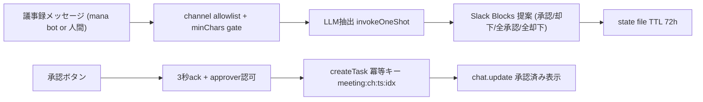

# Meeting task proposal architecture（議事録→タスク候補提示→ワンタップ登録）

## Decision

議事録がSlackの許可チャンネルに投稿されたら、LLMでタスク候補を抽出してSlack Blocksで提示し、
承認ボタン押下でBrainbase Canonical Task（bb.unson.jp companion API）へ冪等登録する。
mana（Lambda版）の `meeting-flow-integration.js` を設計の正として mana-runtime の
Slack connector へ移植する。コードは移植せず、mana-runtime の既存慣行
（task-reminder のstate永続化、goal-extractor のLLM呼び出し分離）で再実装する。

初版スコープ: タスク（actions）のみ。manaが扱っていた決定事項（Graph decisions）と
課題（NocoDB）は登録先が異なるため対象外。タイトル編集UIも対象外。

## Current reality

- mana側の承認フローは「.txtファイルアップロード」だけで発火し、チャンネル単位の
  停止スイッチがない（`processFileUpload.js` にallowlistなし）。登録先はNocoDBで、
  Canonical Task正本（bb.unson.jp）ではない。
- mana-runtime の SlackConnector は Socket Mode（`index.ts:138-142`）。block_actions
  ハンドラの前例はゼロだが、`app.action()` を登録するだけで受けられる。slash command
  `/ryoko-develop`（`index.ts:346`）が「3秒ack→認可→処理」の型。
- connector本体の `app.message` ハンドラは `bot_id` 付きメッセージを捨てる
  （`index.ts:420`）。mana botが投稿する議事録はここを通らないため、本機能は
  独自の `app.message` リスナーを登録する（Boltは複数リスナー可。自bot投稿は
  Boltデフォルトの `ignoreSelf` が除外する）。
- タスク登録は `shared/brainbase-tasks.ts` の `createTask(input, idempotencyKey)`。
  冪等キーを明示しないと毎回 `openryoko:<uuid>` になるため、決定的キーの明示が必須。



## Trust boundaries

- **発火**: `meetingTaskProposal.channels`（チャンネルIDのallowlist）が未設定・空なら
  機能全体が停止（fail closed）。ゲート順: enabled → channels → boot時刻より古い
  メッセージ除外 → `minMessageChars`（既定200字。議事録は長文）→ LLM抽出。
  抽出0件なら何も投稿しない。
- **承認**: `approverUserIds`（未設定時は connector の `allowFrom` にフォールバック。
  どちらも空なら機能停止=fail closed）のユーザーのみボタン有効。認可外の押下は
  ephemeralで拒否。承認者判定は `ApproverResolver` インターフェースに切り出し、
  初版は静的リスト実装。将来Graph SSOTのRACI解決実装へ差し替える（柱2の拡張点）。
- **二重登録防止**: 冪等キー `meeting:<channelId>:<sourceTs>:<index>`（決定的）。
  `api:`/`workflow:` 予約プレフィックスと衝突しない。加えてstate上の候補statusが
  `pending` 以外なら再実行しない。ボタンはchat.updateで承認済み表示に置き換える。
- **サニタイズ**: LLM由来のタイトル等は task-reminder と同じ `sanitize()`
  （制御文字・`<>` 除去）を通してからSlackへ出す。
- `assignee_person_id` は渡さない（Graph person解決が必要で `sato_keigo` は解決不可）。
  担当者・期限根拠はdescriptionに文字列で残す。

## Data

- 提案コンテキスト: `${JINN_HOME}/.meeting-task-proposals.json`
  （manaのDynamoDB TTL 72hの置き換え。`ttlHours` 既定72、アクセス時に期限切れを掃除）
  - key: `<channelId>:<sourceTs>`（同一議事録の再処理防止を兼ねる）
  - value: `{ channelId, sourceTs, proposalTs, createdAt, expiresAt, candidates[] }`
  - candidate: `{ index, title, description, assignee, due, status: pending|approved|rejected, taskId? }`
- 期限切れ後のボタン押下は「期限切れ」をephemeralで返す（manaのblocks復元
  フォールバックは移植しない。復元は不完全で重複登録リスクがあるため）。

## mana との二重動作防止

- manaの発火条件は「.txtファイルアップロード」、本機能は「メッセージ本文」のみ
  （ファイル添付メッセージはスキップ）。発火条件が重ならないため、同一チャンネルに
  両botが居ても同じイベントに二重反応はしない。
- ただしmanaのパイプライン末尾（議事録本文の投稿）に本機能が反応し、mana自身の
  提案UI（NocoDB行き）と併存する。初版はpilotのテストチャンネル
  `9999-manaテスト`(C0A2L9FEKEJ) のみをallowlistに設定して共存を観察する。
  実チャンネル展開時は、manaを止めるスイッチがコードに無いため
  **mana botを該当チャンネルからleaveさせる**（またはmana側 `processFileUpload.js`
  にチャンネルガードを追加する）のが停止手順。mana Lambda版は移行完了後に凍結。

## Failure modes

- LLM抽出失敗・タイムアウト（既定60s）: warnログのみで沈黙（fail-open、
  goal-extractor と同方針）。議事録フロー自体は壊さない。
- companion API失敗: 候補は `pending` のまま残し、押下者へephemeralでエラー通知。
  再押下でリトライ可能（冪等キーが同一なので二重登録しない）。
- `BRAINBASE_TASK_API_BASE_URL/_TOKEN` 未設定: start時にwarnして機能停止。
- gateway再起動: stateファイルで提案コンテキストは生存。再起動前の提案の
  ボタンも（TTL内なら）有効。

## Deployment impact

- Slack App の Interactivity を有効化する必要がある（Socket ModeなのでURL不要。
  Manifest の `settings.interactivity.is_enabled: true`）。未有効だとボタン押下が
  届かない。
- pilot config (`~ryoko/.ryoko/config.yaml`) の `connectors.slack` に追加:

```yaml
meetingTaskProposal:
  enabled: true
  channels: ["C0A2L9FEKEJ"]   # 9999-manaテスト
  # approverUserIds: 省略時は allowFrom（佐藤）にフォールバック
```

- gateway MCPツールは増やさないため、3層placementゲートの変更は不要。

## Release and operator actions

1. Lightsail pilotで `git pull` → `packages/jimmy` で `npx tsc` →
   `sudo systemctl restart openryoko.service`。
2. Slack App の Interactivity 有効化を確認（Socket Mode設定画面）。
3. `9999-manaテスト` に議事録形式のメッセージを投稿 → 候補提示 → 承認 →
   bb.unson.jp のタスクボードに実在することを確認（E2E）。
4. 認可外ユーザーの押下拒否、却下、全承認、再押下の冪等性を確認。

## Observability

- gateway: `journalctl -u openryoko.service` の `[meeting-task-proposal]` ログ
  （検知、抽出件数、登録結果、認可拒否）。
- Slack: 提案メッセージのchat.updateによる ✅承認済み / ❌却下済み 表示。
- Brainbase: bb.unson.jp タスクボードでの実在確認。冪等キーはAPI側監査に残る。

## Rollback

1. config の `meetingTaskProposal.enabled: false` → gateway再起動で完全停止。
2. stateファイル削除で提案コンテキストを破棄可能（登録済みタスクには影響しない）。
3. データ移行なし。mana側のフローは本件で一切変更していない。

## Done evidence

実装後に追記する: unit test / typecheck / pilot E2E（候補提示→承認→正本実在確認）。
