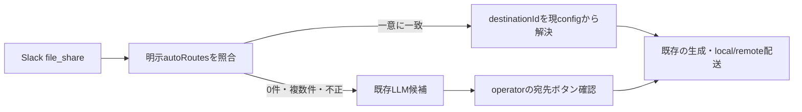

# Recurring meeting auto-routing architecture

Story: `story-recurring-meeting-auto-routing`

## Decision

`meetingMinutesPipeline.autoRoutes`に、安定した`ruleId`、既存の`destinationId`、
`messageTextIncludesAll`または`fileNameIncludesAll`を持つ明示ルールを追加する。
file-share eventからrunを作る時点ではSlack投稿文とファイル名だけを保存せず評価し、
有効なルールがちょうど1件だけ一致した場合に宛先をconfigから解決して配送権限を固定する。

## Match contract

- 文字列は`NFKC`、小文字化、空白連続の単一空白化、trimで正規化する。
- 指定された配列内の空でない語をすべて含む場合に、そのfieldが一致する。
- message/fileの両方を指定したルールは両方の一致を必要とする。
- matcherが1つもないルール、`ruleId`/`destinationId`欠落、未知destinationは候補外とする。
- 正規表現、あいまい一致、transcript本文、LLM結果は権限根拠にしない。
- 複数ルール一致は優先順位で勝者を作らず、手動確認へ戻す。

## State and authority

一意一致時は`destinationId`、project/connector/workspace/channelのsnapshot、
`destinationApprovedBy=config:auto-route:<ruleId>`、`destinationApprovedAt`、`autoRouteId`をrunへ保存する。
投稿直前は既存処理がdestinationを現configから再解決し、snapshot差分があれば停止する。
cross-workspaceは既存の`shareMinutes` gateway以外を通さない。

## Security and privacy

ルールは送信元connectorの設定に閉じ、任意workspaceの内容を共有する包括ルールは設けない。
照合に使ったSlack投稿文は新たに永続化せず、transcript本文も従来どおりhash以外を保存しない。
ログとcontrol messageはrule IDのみを扱い、本文やsecretを含めない。

## Verification

一意一致、未一致、複数一致、未知destination、cross-workspace配送をunit testで固定し、
既存meeting-minutes pipeline testとTypeScript typecheckを実行する。
