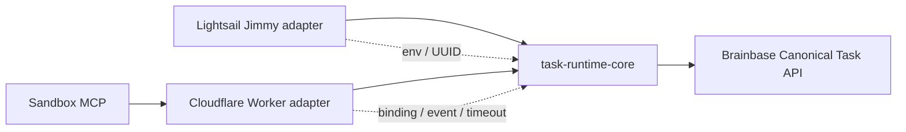

# Canonical Task共通業務コア

## 決定

`packages/task-runtime-core`を新設し、Canonical Taskのdomain型、Brainbase HTTP client、query生成、
error、信頼済みproject scope適用を所有させる。packageはWeb標準の`fetch`、`URL`、`URLSearchParams`
だけを利用し、Node、Cloudflare、Slack、環境変数、secret保存、UIを参照しない。

JimmyとCloudflareはplatform adapterとして残す。Jimmy adapterは`process.env`と`randomUUID`を
共通clientへ注入する。Cloudflare adapterはdeployment binding、timeout、Sandbox向け応答縮小、
Slack event由来の冪等性を注入する。Brainbaseは引き続きCanonical Taskの唯一の正本とする。

## 共通コアの責務

- Canonical Taskと作成・更新・状態遷移・一覧・検索の入出力型。
- Brainbase endpoint、HTTP method、JSON body、Bearer認証、Idempotency-Key、query配列の符号化。
- 非2xxと不正JSONを`TaskApiError(status, code, details)`へ正規化する。
- `applyTrustedProjectScope`により、信頼済みproject codeを正規化・重複排除して入力へ上書きする。
- client生成時に`baseUrl`、`token`、`fetchImpl`を必須注入し、既定secretを読まない。
- 既定冪等性keyは持たず、書き込み呼び出し側が必ずkeyを渡す。platform固有の乱数やevent IDは
  adapterの責務とする。

## Adapterの責務

### Jimmy

- `BRAINBASE_TASK_API_BASE_URL`と`BRAINBASE_TASK_API_TOKEN`の存在判定。
- 既存呼び出しとの互換性のため、明示keyがない書き込みへ`openryoko:<uuid>`を注入する。
- 共通型とerrorを再exportし、既存gateway、Canvas、meeting codeのimportを壊さない。

### Cloudflare

- deploymentの`RUNTIME_PROJECT_CODES`をSandbox生成前に解決する。
- 検索requestは許可queryだけを受け、project codeを共通scopeで強制して一回の上流検索を行う。
- 上流応答は最大20件、256 KiB、5秒に制限し、許可project外のtaskが一件でもあれば全応答を拒否する。
- 議事録タスク登録は候補へbinding projectを共通scopeで上書きし、
  `meeting-task:<eventId>:<candidateIndex>`由来の決定的keyを明示する。
- 共通errorを既存の`task_search_*`、`brainbase_*` errorへ変換し、利用者向け挙動を変えない。

## 信頼境界

- 共通コアはproject codeの出所を判断しない。adapterが信頼済みbindingだけを渡す。
- `applyTrustedProjectScope`は入力に既にあるproject codeを破棄し、bindingの和集合へ置換する。
- Sandboxへ実Brainbase URL、token、binding projectを保存しない。合成hostのWorker handlerだけが
  共通clientを生成する。
- 応答内taskは許可projectとの交差を持つ必要がある。交差がなければ部分削除ではなくfail closedする。
- error details、Authorization、Idempotency-KeyはSlack、prompt、永続Workspaceへ出さない。

## 互換性と移行順序

1. 共通packageの契約テストをRedで追加する。
2. Jimmy clientを薄いadapterへ置換し、既存task testsを通す。
3. Cloudflare検索と議事録タスク登録を共通clientへ載せ替える。
4. Cloudflare一般返信、Jimmy gateway、meeting-taskの回帰を確認する。
5. 次Storyで署名付きevent capabilityと書き込みbudgetを追加し、Cloudflare会話へ汎用write toolsを公開する。
6. Canvasは別Storyでbounded projectionへ変更してからCloudflareへ移す。

## 失敗時

- 共通client設定不足: adapterが現行の設定不足errorへ写像し、APIを呼ばない。
- timeout/network失敗: Cloudflareは既存のupstream unavailable、Jimmyは呼び出し元の既存error処理へ渡す。
- 非2xx: responseの`code`と`message`を保持するが、secretやheaderは保持しない。
- 不正JSON: `task_store_invalid_response`として扱い、成功や0件に変換しない。

## 対象外

- 共通の巨大runtime、Slack connector、Claude session、Canvas UI、会議ファイル処理。
- Cloudflare Sandboxへ書き込みtokenを直接渡すこと。
- 本Story内での本番deploy、Slack App所有権切替、Lightsail停止。
