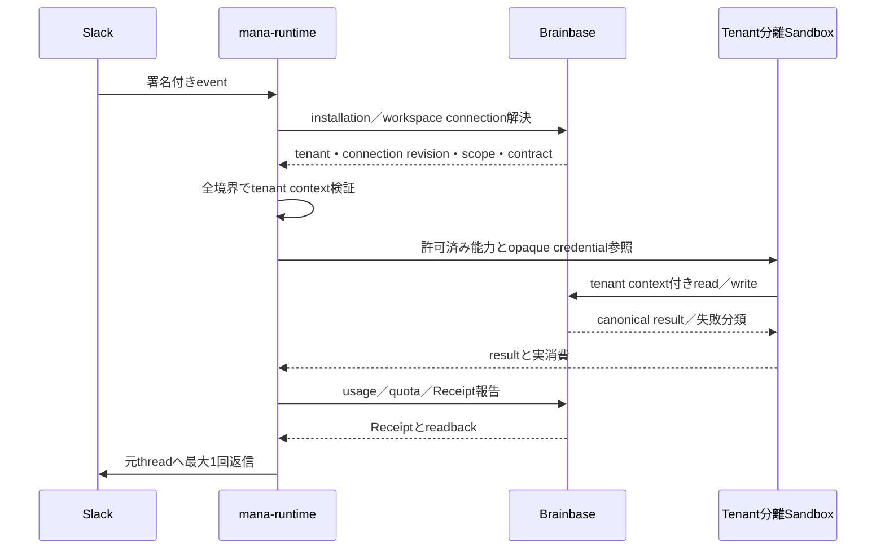

# Slack・Mana・Brainbase横断マルチテナントアーキテクチャ

## 対応Story

- [SlackからBrainbaseまでテナントを越境せず完了する](../management/stories/active/story-slack-mana-brainbase-multitenant-e2e.md)
- [八雲まなをテナント分離されたSlackランタイムとして提供する](../management/stories/active/story-mana-multitenant-runtime.md)
- Brainbase側: `Unson-LLC/brainbase-unson:story-brainbase-multitenant-platform`

## 決定

横断経路の一貫性は、Brainbaseが所有するcanonical tenant／workspace connection／権限／契約と、mana-runtimeが所有するSlack受信／実行分離／配送を、同一correlationと検証済みtenant contextで結ぶことで保証する。

個別systemのCI、deploy、health、返信だけでは完了としない。実Slack eventからBrainbase正本readback、usage Receipt、Slack replyまでを同じevidence chainとして確認する。

## 正本と引渡し境界

| 引渡し | 提供側 | 検証側 | 拒否条件 |
|---|---|---|---|
| installationからconnection解決 | Brainbase | mana-runtime入口 | 未登録、曖昧、失効、別app |
| tenant context | Brainbase | mana-runtime各境界 | 改ざん、古いrevision、scope不一致 |
| runtime operation | mana-runtime | Brainbase業務境界 | tenant、actor、project、capability不一致 |
| usage report | mana-runtime | Brainbase Receipt境界 | correlation不一致、未分類、重複 |
| canonical readback | Brainbase | 統合検証 | tenant／project不一致、partial |
| Slack delivery | mana-runtime | 配送境界 | 元event／tenant／channel不一致、重複 |

## 横断シーケンス

## 横断不変条件

1. tenantはすべてのhopで同一であり、workspaceやprojectから再推測しない。
2. workspace connection revisionは処理開始時と重要な副作用直前に有効である。
3. requester／actorは認証済み主体から導出し、モデルが置換できない。
4. projectとcapabilityはBrainbaseが許可した集合の部分集合である。
5. correlationとidempotencyはSlack eventからwrite、Receipt、replyまで維持する。
6. unavailable、timeout、partial、未計測を0件・0円・成功へ変換しない。
7. 同じeventによるBrainbase writeとSlack replyは最大1回である。
8. どの失敗でも別tenant、credential、deployment、default projectへfallbackしない。

## Evidence chain

evidenceは秘密値を含めず、次の責務を結ぶ。

- 配備: Git revision、runtime／Brainbase version、実行image
- 入口: Slack event、workspace、app、installation
- 権限: tenant、connection revision、placement、requester、project scope
- 実行: correlation、idempotency、credential mode、operation結果
- 正本: Brainbase canonical readbackとevidence state
- 原価: usage、quota、billing Receipt
- 配送: Slack replyとreply count、他runtimeのreply count

証跡が欠けた項目は`not_collected`または同等の未確認状態とし、成功へ含めない。

## 障害責務

| 障害 | 主責務 | 横断動作 |
|---|---|---|
| tenant／connection解決 | Brainbase | mana-runtimeはLLM前に停止 |
| event／context改ざん | mana-runtime | Brainbase業務APIへ送らない |
| policy／project拒否 | Brainbase | 存在を漏らさずSlackへ行動案内 |
| Sandbox／AI／tool | mana-runtime | 実消費を報告し成功扱いしない |
| Brainbase unavailable／partial | Brainbaseが状態を返し、mana-runtimeが保持 | 0件・成功へ変換しない |
| Slack delivery | mana-runtime | write済みかを保持して二重writeを防ぐ |
| Receipt不整合 | 両system | 完了を保留し照合対象にする |

## Credentialと課金経路

Cloud標準API、顧客OAuth、顧客APIのmodeはBrainbase contractから決まり、mana-runtimeが該当tenantのopaque handleを解決する。失敗時はmodeを変更しない。usageは実際に選ばれたmode、tenant、correlationへ帰属し、課金主体と利用者向け失敗表示を同じcontract revisionから導く。

## 配置互換

| Brainbase | mana-runtime | 判定 |
|---|---|---|
| Cloud | shared Cloudflare | 標準positive／negative E2E |
| Cloud | dedicated | 同一契約。物理分離差だけ明示 |
| 互換OSS | sharedまたはdedicated connector | 共通必須機能を検証 |
| 互換OSS | customer-hosted | 任意機能非対応を明示 |

非対応の組合せはnon-applicable fixtureとして理由を固定する。未実行を成功とみなさない。

## Rolloutとrollback

1. fixtureでTenant A/Bの正常・越境否定・非適用を検証する。
2. stagingで同じ入力、tenant context、tool呼出し、正本結果を比較する。
3. production canaryでread-only、承認付きwrite、quota、credential modeを段階確認する。
4. 同一eventのCloudflare単独配送を確認後、旧runtimeを停止する。
5. 失敗時は該当tenantまたはcapabilityだけを停止し、他tenantを継続する。

rollbackでは新旧runtimeの同時replyや二重writeを許さない。connection revisionとidempotencyを維持できない切替は行わない。

## 受入条件との対応

| 受入条件 | Architecture上の保証 |
|---|---|
| `AC-001` | eventからreplyまでcorrelationを保持する。 |
| `AC-002` | tenantと許可projectをBrainbase正本readbackで照合する。 |
| `AC-003` | actor、tenant、project、idempotency付きwriteとreadbackを要求する。 |
| `AC-004` | session、file、credential、tool、result、replyをtenant分離する。 |
| `AC-005` | actor／credential／connectionを使った越境を両境界で拒否する。 |
| `AC-006` | connection異常をBrainbase業務処理前に拒否する。 |
| `AC-007` | quota影響を当該tenantだけに限定する。 |
| `AC-008` | unavailable、partial、timeoutを非成功として保持する。 |
| `AC-009` | event単位の最大1 write／replyを保証する。 |
| `AC-010` | credential mode、課金主体、表示を同じcontract revisionで決める。 |
| `AC-011` | Cloud／OSS共通契約と任意機能差をfixtureで検証する。 |
| `AC-012` | Cloudflare単独配送と他runtime 0 replyを切替条件にする。 |

## Architecture fixture

- positive: Tenant AのSlack read／承認付きwriteがAのBrainbase正本へ到達し、Receiptとreplyが同じcorrelationで1件ずつ残る。
- negative: Tenant A/Bの同時実行、cross-tenant ID、古いconnection revision、失効credential、retryで越境と二重副作用を拒否する。
- non-applicable: OSSまたはcustomer-hostedでCloud固有課金がない場合、任意機能非対応を証跡化し必須contractだけを評価する。

## 整合性判定

| 観点 | Brainbase Architecture | mana-runtime Architecture | 統合判定 |
|---|---|---|---|
| tenant owner | canonical正本 | 解決結果を伝播 | 競合なし |
| connection owner | revision・失効の正本 | installationとeventを照合 | 競合なし |
| credential | modeとopaque参照 | 実行時限定解決 | 本文は境界外へ出ない |
| session／Container | 対象外 | tenant分離を所有 | 責務重複なし |
| contract／quota | 正本と判断 | 実行へ適用 | revisionで一致 |
| usage／Receipt | 集約正本 | 実消費の生成 | correlationで一致 |
| Slack delivery | 対象外 | 最大1回配送 | 責務重複なし |
| Cloud／OSS | 共通接続契約 | profile別実行 | 同じfixtureで評価 |

## Specへの拘束

統合Specは、引渡しごとの入力、検証、成功、失敗、証跡を具体化し、両製品Specのversion互換を明示する。単体テストやdeploy結果だけでE2Eを代替してはならない。

## 非目標

- 各system内部の具体的なAPI、table、Queue、class設計
- Slack Marketplace掲載
- 顧客別の価格・SLA交渉
