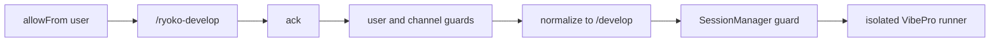
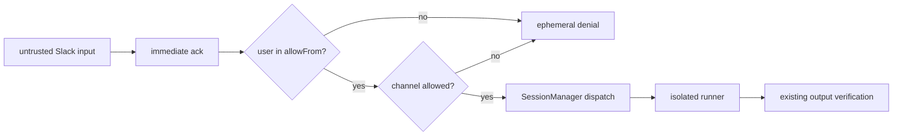

# Slack native development command architecture

## Decision

Slackからの自己開発開始は、通常メッセージに擬似コマンドを書く方式ではなく、
Slack-native `/ryoko-develop` をSocket Modeで受信する。公開HTTP endpointは作らない。

## Current reality

- 自己開発ランナー本体と内部 `/develop` 境界は既に存在するが、Slackからの開始はメンション本文に擬似コマンドを書く必要がある。
- Slack App ManifestはSettings画面から生成される。今回の画面変更はManifest JSONの内容だけで、画面のレイアウトや操作導線は変えない。
- 本番反映にはコード配備だけでなく、Slack AppのManifest更新・再インストールと、許可チャンネル設定が必要である。

## Trust boundaries

- SlackConnectorはack後、`allowFrom` と `developmentRunner.allowedSlackChannels` を検索やdispatchより先に検証する。
- SessionManagerも `allowedSlackChannels` を検証し、旧メンション経路からの迂回を防ぐ。
- 未設定または空のチャンネルallowlistはfail closedとする。
- 許可後は既存 `/develop` 実装を再利用し、shell組立、secret継承、自動PR、merge、deployは追加しない。
- Native commandの応答先は呼出チャンネルのrootであり、Slack thread内起動には依存しない。

## Failure modes

- `allowFrom` または `allowedSlackChannels` が未設定・空なら拒否する。利便性より権限境界を優先する。
- Slack Appを再インストールしていなければ、コマンド自体がSlackに現れない。
- `commands` scopeが不足していればSlack側で登録・実行できない。
- ランナー無効時はエフェメラル応答で拒否し、暗黙の別経路へフォールバックしない。
- Socket Modeやgateway停止時は受信できない。systemdログとSlack App接続状態で切り分ける。
- コマンドはthreadから起動できず、結果は呼出チャンネルrootへ関連付けられる。

## Deployment impact

Slack App Manifest更新後にアプリを再インストールし、`commands` scopeと
slash command登録を反映する。ランタイム設定にはパイロットチャンネルID
`C0A2L9FEKEJ` を `developmentRunner.allowedSlackChannels` として明示する。

## Release and operator actions

1. Settingsが生成するManifestでSlack Appを更新・再インストールし、`commands` scopeと `/ryoko-develop` を反映する。
2. ランタイム設定で `developmentRunner.enabled=true`、`allowedSlackChannels=["C0A2L9FEKEJ"]`、`connectors.slack.allowFrom` を確認する。
3. gatewayを再起動し、許可ユーザー・許可チャンネルからdry-run相当の小さな文書変更を依頼する。
4. 非許可ユーザーまたは非許可チャンネルの拒否を確認する。本番データをfixtureに使わない。

## Observability

- Slack側: 許可外・無効時はエフェメラル拒否、許可時は既存セッション応答を確認する。
- Lightsail側: `journalctl` のgateway起動・Slack Connector接続・dispatch結果を確認する。secret値は出力しない。
- GitHub側: 隔離ランナーが作成したbranch/PRと検証結果を確認し、Slackの「実行中」表示だけで完了扱いにしない。

## Rollback

1. `developmentRunner.enabled=false` にしてgatewayを再起動すれば、コマンドはfail closedで停止する。
2. 必要ならSlack App Manifestからコマンドと `commands` scopeを外して再インストールする。
3. この変更にデータ移行はない。既存のメンション応答と内部ランナー資産は維持される。

## Done evidence

- 現HEADでJimmy/Webのunit test、typecheck、Web production buildが成功している。
- 許可、非許可ユーザー、空allowlist、非許可チャンネル、runner無効、内部 `/develop` 迂回を自動テストで確認する。
- 配備後はパイロットSlackでnative command受付、Lightsailの該当version稼働、隔離branch/PR生成までを別途確認する。配備前のPR検証を本番確認とは呼ばない。
