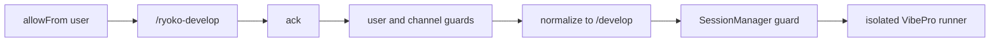

# Slack native development command architecture

## Decision

Slackからの自己開発開始は、通常メッセージに擬似コマンドを書く方式ではなく、
Slack-native `/ryoko-develop` をSocket Modeで受信する。公開HTTP endpointは作らない。

## Trust boundaries

- SlackConnectorはack後、`allowFrom` と `developmentRunner.allowedSlackChannels` を検索やdispatchより先に検証する。
- SessionManagerも `allowedSlackChannels` を検証し、旧メンション経路からの迂回を防ぐ。
- 未設定または空のチャンネルallowlistはfail closedとする。
- 許可後は既存 `/develop` 実装を再利用し、shell組立、secret継承、自動PR、merge、deployは追加しない。
- Native commandの応答先は呼出チャンネルのrootであり、Slack thread内起動には依存しない。

## Deployment impact

Slack App Manifest更新後にアプリを再インストールし、`commands` scopeと
slash command登録を反映する。ランタイム設定にはパイロットチャンネルID
`C0A2L9FEKEJ` を `developmentRunner.allowedSlackChannels` として明示する。
