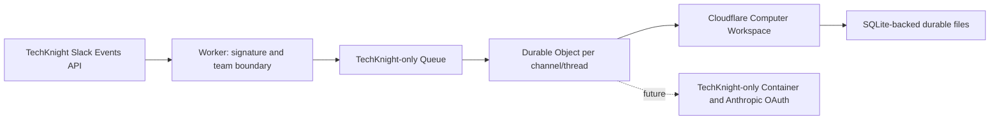

# TechKnight Cloudflare Computer PoC architecture

## Decision

TechKnight専用のCloudflare WorkerをSlack Events API入口とし、署名とteam IDを検証してから
Queueへ投入する。Queue consumerは`techknight:channel:thread`をDurable Object名として選び、
`@cloudflare/computer`のWorkspaceへイベントを保存する。会社を表すtenantはrequest bodyから
採用せずdeployment固定値とSlack team IDの一致から決定する。

## Trust boundaries

- `x-slack-request-timestamp`とraw bodyをHMAC-SHA256で検証し、5分を超えるrequestを拒否する。
- `team_id`は環境設定のTechKnight Slack team IDと完全一致させる。
- tenant ID、Queue、Durable Object binding、将来のOAuth secretはTechKnight deploymentに固定する。
- Queue messageは必要最小限のSlack event metadata/textだけを持ち、tokenや全headerを持たない。
- Durable Objectの内部ingest routeはQueue consumerだけがstub経由で呼ぶ。

## Runtime seam

PoCではComputerのdurable filesystemを先に検証する。Claude CLIを動かすfull Linux backendは
`@cloudflare/computer`のContainer backendへ後から接続する。プレビューAPIへの依存をこのpackageへ
閉じ込め、既存mana-runtimeのSlack/Brainbase業務ロジックを移植しない。

## Deployment gate

現在のWrangler identityがTechKnight所有accountでない場合、resource作成とdeployを行わない。
ローカルtest/typecheck/`wrangler deploy --dry-run`までは実施できる。TechKnight accountへ切替後に、
専用Queue、Worker、Durable Object migrationを一つのPoC environmentとして作成する。

## Exit criteria for the next phase

次段階は、実Cloudflare上で再配送の冪等性とWorkspace永続性を確認し、TechKnight専用Containerへ
Claude CLIを配置してAnthropic OAuthがUnsonと共有されないことを証明する。そこまで確認するまで
Lightsailの廃止判断はしない。
