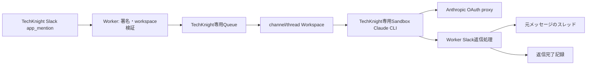

# TechKnight Cloudflare Slack返信アーキテクチャ

## Decision

既存の署名検証済みSlackイベントをQueue consumerで処理し、channel/thread単位のWorkspaceへ
受信イベントと返信完了記録を保存する。未完了の許可イベントだけTechKnight専用Sandboxで
Claude CLIへ渡し、WorkerからSlack Web APIを呼んで元メッセージのスレッドへ返信する。

## Trust boundaries

- tenantとworkspaceはdeployment固定値とし、Slack payload由来の会社境界を信用しない。
- 対象channel IDをdeployment設定で固定し、他channelはClaude実行前に除外する。
- Slack Bot tokenとAnthropic OAuth tokenはWorker secretとし、SandboxへBot tokenを渡さない。
- OAuth tokenは既存HTTPS proxyがAnthropic宛リクエストへ注入し、Claude CLIへ実値を渡さない。
- Slack本文は長さを制限し、制御文字を除き、shell引数として安全に引用する。
- Bot投稿と`bot_id`を持つイベントは自己応答ループ防止のため除外する。

## Delivery and idempotency

Workspaceの`replies/<event-id>.json`を完了記録とする。完了記録があれば再配送をackする。
ClaudeまたはSlack APIの失敗時は記録せずQueue retryとする。Slack投稿成功から完了記録までの
プロセス停止には重複可能性が残るため、Slackへ決定的な`client_msg_id`も送る。

## Failure behavior

- Claude実行失敗または空応答: 例外としてQueue retry。
- Slack HTTP失敗または`ok:false`: 例外としてQueue retry。
- 対応外イベント: ackし、外部呼び出しをしない。
- 最大retry後のdead-letter運用は既存Queue設定に従い、秘密値を含まない構造化ログでevent IDを追跡する。

## Deployment gate

TechKnight Cloudflare account identity、既存Worker secrets、八雲まなBot tokenの取得元を値非表示で確認する。
ローカルtest、typecheck、dry-run、VibePro検証を通したmainの正確なSHAをデプロイし、
`#manaテスト`の実返信とWorker tailで受信・生成・投稿・完了を確認する。
