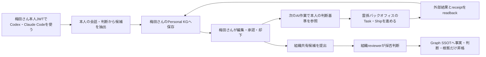

# 梅田さんが組織版MANAでPersonal KGと雲孫バックオフィス業務を安全に使う

## Background

Brainbase側には`owner_person_id`と`organization_id`による複数人分離の土台がある一方、既存の会話収集、所有者正規化、MCP認証、本人レビュー、組織Graph昇格には「佐藤さん一人で使う」前提が残っていると整理されている。

確認済みの主なギャップは次である。

- 所有者未指定時に佐藤さんへ寄る互換経路
- Codex・Claude Codeの会話収集に佐藤さん固定の経路
- 共有HTTP MCPのservice token前提と本人JWT導線の不整合
- 佐藤さんと梅田さんの実tokenを用いた相互非漏洩E2E不足
- Personal KG本文を組織Graphへコピーし得る昇格経路
- 本人同意と組織採用の分離不足
- Ship、外部結果、検証証跡をPersonal KGへ戻す汎用関連の不足

梅田さんへの導入は、アカウントを発行して会話できた時点では完了しない。本人所有のPersonal KGと`雲孫バックオフィス`の組織文脈を安全に使い、MANAの支援によって実務Shipを証拠付きで閉じ、本人が初回価値を評価した時点を完成条件とする。

## Target Flow

## Policy

- Personal KG本文は梅田さん本人だけが閲覧・編集できる。
- 組織管理者には同期状態、件数、エラー、監査結果だけを見せる。
- ownerは本人JWTから導出し、CLI引数、環境変数、LLM出力から別人を指定できない。
- `actor_person_id`、`owner_person_id`、`organization_id`、`project_codes`を分離する。
- owner不明、owner詐称、organization不一致、project範囲外はfail closedとする。
- Personal KG本文を組織Graphへコピーしない。
- 組織共有は「本人の共有同意」と「組織reviewerの採用」を別の状態・actor・receiptとして記録する。
- 梅田さん固有の名前分岐をmana-runtime coreへ追加しない。`backoffice_member`等のrole、Graph、policy、configurationで表現する。
- 完了は接続成功ではなく、本人学習ループと実務Shipのreadbackで判定する。

## Acceptance Criteria

- [ ] AC-1: 梅田さん本人のJWTを発行・refreshし、Codex・Claude Code双方のprofile別MCP設定を生成できる。
- [ ] AC-2: setup時に、梅田さんのcanonical person、雲孫organization、許可project、token expiryを本人へreadbackする。
- [ ] AC-3: 梅田さんの実tokenで作成したPersonal KG候補は梅田さんだけが検索・編集・承認でき、佐藤さんの実tokenからは存在自体を推測できない。
- [ ] AC-4: 佐藤さんのPersonal KGも梅田さんから参照できず、ownerなし、owner詐称、organization不一致、service proxyからの越境をすべて拒否する。
- [ ] AC-5: Codex・Claude Codeの会話収集はownerを固定値や自由入力から取得せず、本人セッションから導出する。
- [ ] AC-6: 生の会話ログは原則として本人端末へ残し、サーバーへはhash、出典、許可済み抜粋、抽出候補、機微区分だけを送る。
- [ ] AC-7: 会話→Personal KG候補→本人編集・承認→次の会話で承認済み判断を再利用する流れを同一correlation IDで完走する。
- [ ] AC-8: 本人レビューと組織Graph昇格レビューを別キューにし、本人同意だけではGraph SSOTへ確定しない。
- [ ] AC-9: 組織reviewerが採用した場合も、Graphへは正規化済みの事実・判断・関係と根拠ポインタだけを書き、Personal KG本文を復元できない。
- [ ] AC-10: 梅田さんが`雲孫バックオフィス`の組織文脈、RACI、担当Taskを許可範囲で参照し、MANAの支援で実務Shipを1件完了する。
- [ ] AC-11: 実務Shipは成果物、外部readback、Operation Receiptを同一correlation IDへ結び付け、証拠なしでは完了にしない。
- [ ] AC-12: Ship完了後、梅田さんが初回価値を`useful / not_useful`で評価し、判断・実行・結果・評価を関連付ける。
- [ ] AC-13: ステージングE2Eが成功するまで本番アクセス済みと扱わず、本番付与後も初期scopeをperson=梅田、organization=雲孫、project=`雲孫バックオフィス`へ限定する。
- [ ] AC-14: mana-runtime coreに梅田さんのperson ID、氏名、Slack IDをハードコードしない。

## Scenarios

- `UMEDA-S-001`: Given 梅田さん本人JWTでCodexからPersonal KG候補を作ると、ownerは梅田さんから導出され、次の会話で本人だけが参照できる。
- `UMEDA-S-002`: Given 佐藤さんが梅田さんの候補IDまたは検索語を指定しても、存在非開示で拒否される。
- `UMEDA-S-003`: Given owner引数に佐藤さんまたは別personを指定しても、本人JWTと不一致のため拒否される。
- `UMEDA-S-004`: Given 梅田さんが候補を個人利用へ承認すると、次のAI作業で参照されるが、組織Graphにはまだ現れない。
- `UMEDA-S-005`: Given 梅田さんが組織共有へ同意すると、`pending_org_review`になり、別の組織reviewerが採用するまでGraphへ確定しない。
- `UMEDA-S-006`: Given 組織reviewerが採用すると、Graph entityとPersonal側receiptが同一runで照合できるが、GraphからPersonal本文を復元できない。
- `UMEDA-S-007`: Given 雲孫バックオフィスの実務が停滞すると、MANAが梅田さんの役割に沿って次の行動または判断を提示し、外部readbackまで追跡する。
- `UMEDA-S-008`: Given ステージングE2Eのいずれかが`partial`または`not_collected`なら、本番付与を成功扱いにしない。

## Staging E2E

同一runで次を完走する。

1. 梅田さん本人としてログインする。
2. CodexまたはClaude Codeで実務を進める。
3. 会話からPersonal KG候補を作る。
4. 梅田さんが候補本文を編集し、個人利用へ承認する。
5. 次の会話で承認済み判断を参照する。
6. 共有可能な候補だけを組織レビューへ提出する。
7. 組織reviewerが採否を判断する。
8. 採用された事実・判断をGraphへ昇格して再検索する。
9. 雲孫バックオフィスの実務Shipを外部へ出す。
10. 成果物、外部readback、receiptを照合する。
11. 梅田さんが`useful / not_useful`を付ける。
12. 佐藤→梅田、梅田→佐藤の相互非漏洩結果をreadbackする。

## Initial Production Scope

- person: Graph上の梅田さんcanonical person ID
- organization: 雲孫
- project: `雲孫バックオフィス`
- Personal KG: 本人所有データの作成・検索・編集・承認
- Organization Graph: 許可範囲の参照
- Organization promotion: 候補提出まで
- Organization acceptance: 別の組織reviewerだけが実行
- 他人のPersonal KG、範囲外project、service proxyによる本人操作: deny

## Completion Evidence

- 梅田さん・佐藤さんの実tokenを使った相互非漏洩E2E
- Codex・Claude Code双方の本人scope readback
- 会話候補のowner、source、hash、revision、機微区分
- 本人レビューと組織採用の別actor・別receipt
- Graph entityと根拠ポインタのreadback
- 雲孫バックオフィスの成果物・外部readback・Operation Receipt
- `useful / not_useful`評価

## Out of Scope

- TechKnight shared-cloudのtenant間分離証明
- 組織管理者によるPersonal KG本文閲覧
- 本人同意だけでのGraph昇格
- すべての雲孫projectへの初期アクセス
- 梅田さん固有コードのruntime core追加
