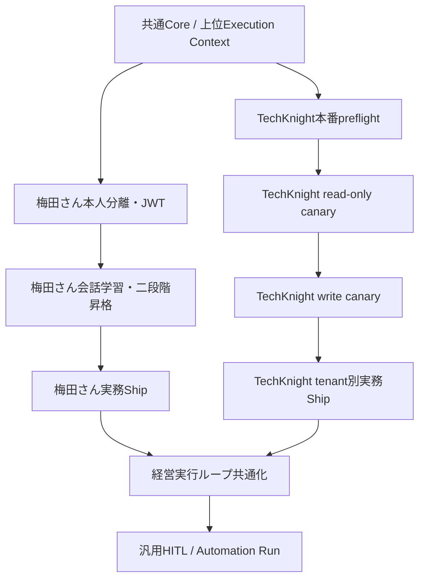

# 組織版・マルチテナント・経営実行ループ統合計画

- **作成日**: 2026-08-19
- **対象**: `mana-runtime`、Brainbase接続契約、個人版OSS、組織版、TechKnight shared-cloud実運用
- **基準**: `main` `efa1dbb9497703d6b5c47b5b63ffd82550fbc7b1`
- **方針正本**: [`docs/management/roadmap.md`](../management/roadmap.md)
- **本番E2E手順**: [`docs/operations/mana-multitenant-production-e2e-runbook.md`](../operations/mana-multitenant-production-e2e-runbook.md)
- **性格**: 実装・検証・ロールアウトの統合計画。日々の進行状態はCanonical Task / Automation Runへ置き、本書へ重複保存しない。

## 1. 結論

MANAは「会社について回答できるAI」ではなく、Brainbaseにある会社の目的・責任・権限・判断を参照し、会社の意思決定を証拠付きのShipまで閉じる経営実行コントローラとして設計する。

製品は次の関係にする。

```text
個人版OSS
  = 共通MANA Core
  + 個人コンテキスト
  + Personal KG
  + 個人Task・Ship

組織版
  = 個人版OSSの全能力
  + 組織Graph
  + 組織目標
  + RACI
  + 共有Task・Ship
  + 承認・監査
  + 複数人への働きかけ

配備形態
  = customer_managed_oss | dedicated_cloud | shared_cloud
```

組織版は**能力上の上位互換**であり、個人データへのアクセス権上の上位互換ではない。組織管理者がPersonal KG本文を当然に閲覧できる構造にはしない。

検証を二つの実運用へ分ける。

- **梅田さん・雲孫バックオフィス**: 同一organization内のperson、Personal KG、RACI、共有業務、組織版の実務Shipを縦断検証する。
- **TechKnight**: 複数実tenantを`shared_cloud`へ収容し、workspace connection、credential、状態、Usage・Receipt、障害、実務Shipを横断検証する。

## 2. 2026-08-19時点の正本整理

### 2.1 mana-runtime実装

マルチテナント実装は、巨大umbrellaを一括mergeせず、責務別のR1〜R5として`main`へ統合済みである。

| PR | 内容 | merge commit |
|---|---|---|
| [#294](https://github.com/Unson-LLC/mana-runtime/pull/294) | canonical tenant contract | `b59171154be4042104175cc3c19292f4aac6203c` |
| [#295](https://github.com/Unson-LLC/mana-runtime/pull/295) | runtime / Queue / Durable Object / idempotency | `56cb926352472644178c843fa16ba858b4af7cd8` |
| [#296](https://github.com/Unson-LLC/mana-runtime/pull/296) | Slack ingress / commands / OAuth | `9536956dd2add4de16e0fa8b49535dc2f8561e6a` |
| [#297](https://github.com/Unson-LLC/mana-runtime/pull/297) | meeting minutes / Task Canvas | `eb3fb8cbd7f0e542cfc86d9405afa766725779e7` |
| [#298](https://github.com/Unson-LLC/mana-runtime/pull/298) | provider / Container / deployment profile / readiness | `701d71229ae7aa3b7c52a8659eb8e5fb3f8e6e5c` |

Brainbase producer側の対応契約 [#1257](https://github.com/Unson-LLC/brainbase-unson/pull/1257) も統合済みである。

### 2.2 未完ゲート

- canonical source-lock: `merge_allowed: true`
- canonical source-lock: `deploy_allowed: false`（`true`にする場合も、意味はレビュー済み構成を本番検証へ投入してよいという許可に限る。実Slack E2E、Safety／Value Gate、切替完了を意味しない）
- Cloudflare本番配備: `not_collected`
- 実Slack E2E: `not_collected`
- Brainbase UsageEvent / Operation Receipt readback: `not_collected`
- TechKnightの2実tenant Safety Gate / Value Gate: `not_collected`

横断E2E Story・SpecはDraft [#293](https://github.com/Unson-LLC/mana-runtime/pull/293)で追跡する。実装正本は`main`であり、#293を実装ブランチとして扱わない。

### 2.3 廃止した経路

- 旧stack [#234](https://github.com/Unson-LLC/mana-runtime/pull/234): superseded close
- 旧横断PR [#237](https://github.com/Unson-LLC/mana-runtime/pull/237): 包含済みclose
- umbrella [#292](https://github.com/Unson-LLC/mana-runtime/pull/292): R1〜R5へ分割済みclose
- Brainbase旧PR [#1229](https://github.com/Unson-LLC/brainbase-unson/pull/1229): `develop`へ完全包含済みclose

旧PRから再merge、cherry-pick、仕様復元を行わない。新しい修正は現在の`main`とcanonical contractから分岐する。

## 3. 完成状態

### 3.1 MANAの行動契約

各イベントまたは定期巡回で、MANAは次を閉じる。

```text
Context Resolution
  → Gap Detection
  → Next Best Action
  → Authority Resolution
  → Auto Execute / Human Decision Packet / Deny
  → Follow-up / Escalation
  → Ship Readback
  → Evidence-backed Completion
  → Learn
```

#### Context Resolution

Brainbaseから次を取得する。

- Goal / Outcome / Shipと成功条件
- Project、Task DAG、期限、依存関係
- person、organization、tenant、RACI
- 過去の判断、制約、停止条件
- placement、capability、budget
- 成果物、readback、Receipt

取得失敗は「存在しない」に丸めず、`partial`または`not_collected`として扱う。

#### Gap Detection

少なくとも次を決定論的に検出する。

- 期限超過
- 担当不在
- 判断待ち
- 依存先停止
- 完了報告はあるが証拠不足
- Taskは進んでいるがShipに近づいていない
- Shipは出たがOutcomeを確認できていない

#### Authority Resolution

```text
auto
  policyとRACIの範囲内でMANAが自動実行する

approval
  MANAが実行案を準備し、指定承認者の選択後に続行する

human_action
  人間本人の行為または対外責任が必要

deny
  権限外、情報不足、停止条件該当のため実行しない
```

分類はモデルの自信度で決めず、Graph・policy・connection revisionから決定論的に解決する。

#### Human Decision Packet

人間へは全件一覧や「進捗どうですか」を送らない。最低限、次を含む。

- 必要な判断または行動
- 推奨案
- 根拠と選択肢ごとの帰結
- 判断期限
- 未実行時の事業影響
- 回答ボタンまたは一意な応答方法
- 次のエスカレーション先

#### Completion

Task状態やAIの自己申告だけで完了にしない。次のいずれかをcorrelation IDへ結び付ける。

- 成果物URIとhash
- 本番URLまたはデプロイ結果
- GitHub merge/readback
- API readback
- 顧客への送信・受領・反応
- KPI差分
- Operation Receipt

### 3.2 製品互換契約

個人版OSSと組織版は、次のCore契約を共有する。

- Decision → Work → Ship → Learn
- Task・Ship・Receiptの型
- connector interface
- memory / Personal KG interface
- execution context
- policy / authority interface
- idempotencyとfailure vocabulary
- evidence-backed completion

組織版CIは、個人版OSSの契約テストをそのまま実行する。組織版だけで通る別Coreへ分岐させない。

## 4. 設計境界

### 4.1 上位Execution Context

canonical tenant contextを土台に、個人・組織・shared-cloudを一つの責任契約で扱うため、全入口・内部境界・外部書き込みで次を保持する。

```ts
interface ExecutionContextV1 {
  tenant_id: string;
  organization_id: string | null;
  actor_person_id: string;
  owner_person_id: string;
  workspace_connection_id: string | null;
  connection_revision: string | null;
  project_codes: string[];
  placement_id: string;
  correlation_id: string;
  policy_revision: string;
}
```

- `actor_person_id`: 実際の依頼者・承認者・実行主体
- `owner_person_id`: Personal KGや個人データの所有者
- `organization_id`: 業務Graph所有組織
- `tenant_id`: 契約・データ分離・予算・監査単位
- `workspace_connection_id`: Slack等の認証済み接続
- `placement_id`: MANAの役割・権限・ツール境界

値をSlack本文、LLM出力、自由入力CLI引数から採用しない。未解決、不一致、複数一致、古いrevisionではfail closedし、佐藤さん、雲孫、TechKnight、default tenant、default placementへ寄せない。

### 4.2 Personal KGと組織Graph

- 本人JWTからownerを導出する。
- 別人のownerをCLI引数・環境変数・tool inputで指定できない。
- 組織管理者へは同期状態、件数、エラー、監査結果だけを見せる。
- Personal KG本文を組織Graphへコピーしない。
- 本人が共有同意した候補を組織reviewerが採用した後、正規化済み事実・判断・関係と根拠ポインタだけを昇格する。

```text
personal_candidate
  → owner_approved_for_personal_use
  → owner_consented_for_org_review
  → pending_org_review
  → org_accepted | org_rejected
```

### 4.3 tenantとworkspace connection

tenantはSlack workspaceではない。Brainbaseの`workspace_connection`を正本として、app、team/workspace、enterprise、installer、scope、revision、status、contractからcanonical tenantを解決する。

次ではモデル実行前に拒否する。

- 未契約
- 未登録
- connection失効
- 別app
- scope不足
- tenant複数一致
- revision不一致

### 4.4 credential

Brainbaseをcredential/refreshのownerとし、mana-runtimeはopaque `credential_ref` と短命single-use lease/proxyだけを扱う。

- token本文をQueue、DO、Container入力、MCP設定、通常ログ、Receiptへ出さない。
- tenantの認証失敗時に運営者credential、別tenant、別方式へfallbackしない。
- credential lease直前にconnection revisionをauthoritative readする。

### 4.5 Containerと状態

protocol v1ではcross-tenant Container再利用を禁止する。tenant変更時は必ず破棄する。同一tenant内の再利用も、process、filesystem、environment、credential、transcriptのsanitization Receiptが取れない場合は破棄する。

次をtenant scopeへ含める。

- Queue messageとclaim
- Durable Object key
- sessionとthread history
- filesystemと添付ファイル
- cache
- MCP config
- secret handle
- UsageとReceipt
- budgetとretry状態
- idempotency key

## 5. 実装レーン

### Lane A: Core Compatibility

**目的**: 個人版OSSと組織版を同じCoreで動かし、組織版を能力上の上位互換にする。

**作業**:

- 上位`ExecutionContextV1`とvalidatorを共通packageへ置く
- personal / organization capabilityをpolicyで追加し、別Coreにしない
- `customer_managed_oss | dedicated_cloud | shared_cloud`を明示する
- owner・organization・tenantの暗黙fallbackを削除する
- 個人版契約テストを組織版CIへ組み込む
- organization edition固有コードはadapter、Graph、policy、configurationに限定する

**Gate A**:

- 個人版の主要な会話、Task、memory、Ship契約が組織版でも同一fixtureで通る
- organization capabilityを無効にすれば個人版と同じ挙動になる
- owner、organization、tenant未解決でモデル・toolを呼ばない

### Lane B: Organization Capability / 梅田さん

**目的**: 梅田さんが、本人所有のPersonal KGと雲孫バックオフィスの組織文脈を混線なく利用し、実務Shipまで閉じる。

**作業順**:

1. 本人分離
   - 単一所有者モデルと`sato_keigo`暗黙fallbackを排除
   - actor、owner、organizationを分離
   - Personal KG操作を本人scope付きtransactionへ統一
   - 佐藤・梅田、別organization、service proxyの相互非漏洩テスト
2. 本人単位のCodex・Claude Code接続
   - 梅田さん本人JWTの発行・refresh
   - profile別token保存
   - person、organization、project scopeのsetup readback
   - 両クライアント向けMCP設定
3. 会話学習
   - ownerを本人セッションから導出
   - 生ログは原則として本人端末へ残す
   - hash、出典、許可済み抜粋、抽出候補だけを送る
   - 重複排除、機微区分、保存拒否
4. 本人レビューと組織昇格
   - 本文編集とrevision監査
   - owner同意と組織採用の二段階
   - Personal本文をGraphへコピーしない
5. ステージングE2Eと限定本番
   - `雲孫バックオフィス`にscopeを限定
   - 実務Ship、readback、Receipt、`useful / not_useful`を同一runへ関連付ける

**Gate B**:

- 梅田さんの候補は梅田さんだけが検索・編集・承認できる
- 佐藤さんからは存在を推測できない
- 本人JWTでCodex・Claude Code双方からPersonal KGと組織Taskを利用できる
- 会話→候補→本人レビュー→次の会話で再利用を完走する
- 本人同意だけでGraphへ確定せず、組織reviewerの採用を必要とする
- 雲孫バックオフィスの実務Shipを1件、証拠付きで完了する
- 梅田さん固有の名前分岐がruntime coreに存在しない

### Lane C: TechKnight Shared Cloud

**目的**: `main`へ統合済みの実装を、TechKnightの複数実tenantで本番検証する。

**作業順**:

1. Brainbase control planeへ2つ以上の実tenantとworkspace connectionを登録
2. authority、JWKS、audience、project、capability、Slack scopes、OAuth、quota、credential broker、accountingをpreflightで検証
3. source-lockの`deploy_allowed: false`を維持したままdry-runとreadinessを取得
4. A（レビュー済みコード／設定commit）から、二つのsource-lockだけに`deploy_allowed: true`と期限付き`deployment_authorization`を記録したB（Aの直接子であるauthorization-only commit）を作る。Bの`deployment_authorization.reviewed_commit_sha`はA、`MANA_DEPLOY_CANDIDATE_COMMIT`はBを指す。デプロイ前にA→Bの直接親関係と変更ファイル集合を検査し、コード・設定を含む候補を拒否したうえで、承認されたtargetだけへCloudflare deployする（これは本番検証の投入であり、E2E／Safety／Value Gate／切替完了とは別）
5. tenant単位でread-only canary
6. 正常、越境拒否、再配送、revision更新、依存障害、Usage/Receiptをreadback
7. Safety Gate成立後、tenant単位でTask write、議事録、外部操作を段階開放
8. 各tenantで実務Shipを1件以上完了
9. 同一runの証拠が揃った後、Story証拠と後段ゲートの結果を更新する。source-lockの配備許可は再利用せず、検証終了または期限到来時に`deploy_allowed: false`と`deployment_authorization: null`へ戻す

**Safety Gate C**:

- tenant Aからtenant Bのsession、file、Task、credential、Usage、Receiptを取得できない
- 同名workspace/channel/userでもcanonical IDが混線しない
- Queue再送でmodel、Brainbase write、Slack deliveryを二重実行しない
- Tenant Aの障害・失効・予算超過でTenant Bを停止しない
- cross-tenant Container reuseが0件
- Cloudflare返信1件、旧runtime返信0件

**Value Gate C**:

- 各実tenantでMANAが会社文脈・RACI・Taskを解決して実務を前進させる
- 各tenantで少なくとも1件、外部成果をreadbackして証拠付き完了にする
- tenant別の成果単位AI費用と人間判断介入回数を計測する

### Lane D: Management Execution / Value Validation

**目的**: 基盤の完成ではなく、MANAが人間の見張りなしにShipを閉じることを梅田さん業務とTechKnight tenantで証明する。

**共通機能**:

- Goal / Outcome / Ship / Task / RACIの相関
- 期限超過、担当不在、判断待ち、依存停止、証拠不足の検出
- Next Best Actionの選択
- `auto / approval / human_action / deny`
- Human Decision Packet
- 再通知、代替案、エスカレーション
- 外部readback
- evidence-backed completion
- 結果のBrainbase学習候補化

**Gate D**:

- MANAが人間から言われる前に停滞を1件検出する
- 権限内の作業を1件、自律的に外部readbackまで完了する
- 人間に必要な判断を推奨・期限・影響付きで提示する
- 未回答時に同じ通知を連打せず、判断コストを下げて再介入する
- 証拠がなければ完了にしない
- 同じ契約を梅田さん業務とTechKnight tenantで再利用する

## 6. 依存関係



依存を次のように扱う。

- Core契約が未固定のまま、梅田さん固有実装またはTechKnight固有実装をruntime coreへ入れない。
- 梅田さんの本番付与は、本人相互非漏洩とステージングE2Eの後に行う。
- TechKnight deployは、preflightとsource-lock gateを通したtargetだけに行う。
- TechKnight write capabilityは、read-only canaryと否定E2Eの後にtenant単位で開放する。
- Safety Gateだけ、またはValue Gateだけを通して完了としない。

## 7. E2Eマトリクス

| Case | Profile | Actor / Tenant | 期待結果 |
|---|---|---|---|
| 個人版基本契約 | customer-managed OSS | local person | 会話、Personal KG、Task、Shipが単独で動く |
| 組織版個人モード | dedicated cloud | 梅田さん | 個人版と同じ契約が動き、Personal KGは本人だけが参照 |
| 組織業務 | dedicated cloud | 梅田さん / 雲孫 | back-office RACI範囲で共有Task・Shipを進める |
| Personal越境拒否 | dedicated cloud | 佐藤→梅田、梅田→佐藤 | 存在非開示で拒否 |
| Personal→組織共有 | dedicated cloud | 梅田→組織reviewer | 二段階承認後、正規化済み事実と根拠だけGraphへ昇格 |
| shared-cloud成功A | shared cloud | TechKnight実tenant A | canonical tenantで一般返信・検索・Receipt |
| shared-cloud成功B | shared cloud | TechKnight実tenant B | Aと独立して同じ成功契約 |
| tenant越境拒否 | shared cloud | A→B / B→A | session、Task、file、credential、Usage、Receiptを取得不能 |
| 再配送 | shared cloud | 同一event | model、write、deliveryの各effectは1回だけ |
| connection失効 | shared cloud | tenant A | LLM前に拒否し、tenant Bは継続 |
| budget hard stop | shared cloud | tenant A | Aだけ停止し、Bは継続 |
| 依存障害 | shared cloud | authority/quota/credential/accounting | 成功や0件へ丸めず、明示的失敗またはretry |
| 実務Ship | dedicated/shared | 梅田 / A / B | 外部readbackと証拠付き完了を取得 |

## 8. ロールアウト

### 8.1 梅田さん

1. 本人相互非漏洩テスト
2. 本人JWTとprofile別MCP設定
3. ステージングで会話学習・本人レビュー・再利用
4. 組織共有候補と二段階採用
5. `雲孫バックオフィス`限定本番
6. 実務Shipと評価のreadback
7. 証拠に基づくscope拡張

### 8.2 TechKnight

1. 2実tenantとworkspace connectionをBrainbaseへ登録
2. 実target値をpreflightへ固定
3. source-lockとreadiness結果をreview
4. read-only capability OFFのままdeploy
5. version、image digest、Git SHA、connection revisionをreadback
6. tenant単位でread-only canary ON
7. 成功・拒否・再配送・依存障害・Usage/Receipt readback
8. tenant単位でwrite capability ON
9. 各tenantの実務Ship確認
10. 証拠が揃った後だけ通常運用へ移行

## 9. ロールバック

### 梅田さん

- Personal KG writeまたは組織共有を先に停止する。
- Graph read-onlyと本人認証の診断経路は維持する。
- owner不明やorganization不一致を佐藤さんへfallbackしない。
- 失敗した候補は`pending`または`not_collected`として残し、別人へ移管しない。

### TechKnight

- 対象tenantのwrite capabilityを先にOFFにする。
- read-only経路を安全に維持できる場合だけ維持する。
- shared-cloud境界に疑義がある場合は、対象tenantを停止または`dedicated_cloud`へ隔離する。
- 既知のdeployment versionとContainer imageを保持し、readback完了前に削除しない。
- tenant Aのrollbackでtenant Bを巻き戻さない。
- 旧runtimeを戻す場合もCloudflareと同一入口を同時に主系化しない。

## 10. 完了判定

この計画は、次がすべて成立した時点で完了とする。

1. 組織版CIで個人版OSSの共通契約が通る。
2. actor、owner、organization、tenant、project、placementが全経路で明示され、暗黙fallbackがない。
3. 梅田さんの本人相互非漏洩、会話学習、本人レビュー、二段階共有、実務Ship、評価がfresh E2Eで証明される。
4. TechKnightの少なくとも2実tenantで、Safety GateとValue Gateが本番readbackされる。
5. Cloudflare返信1件、旧runtime返信0件、UsageEventとOperation Receiptが同一correlation IDで照合できる。
6. 経営実行ループが梅田さん業務とTechKnight tenantで同じ契約を再利用する。
7. 完了したShipが、成果物または本番結果、Receipt、学習候補まで一つのcorrelation IDで追える。
8. Personal KG越境事故とtenant境界事故が0件である。

## 11. 今回の対象外

- shared-cloud完成前の課金・請求・reseller機能
- tenantセルフ申込の完成UI
- 顧客名・梅田さん名を埋め込んだruntime core分岐
- 表に見える専門エージェントの乱立
- 成果・判断・証拠との関連がない会話全文保存
- 人間レビューなしのPersonal→Organization昇格
- 本番readbackなしの「対応済み」「上位互換」「マルチテナント完了」という宣言

## 12. 関連Story

- [`story-personal-organization-core-compatibility`](../management/stories/active/story-personal-organization-core-compatibility.md)
- [`story-umeda-organization-onboarding-e2e`](../management/stories/active/story-umeda-organization-onboarding-e2e.md)
- [`story-management-execution-loop`](../management/stories/active/story-management-execution-loop.md)
- [`story-mana-multitenant-runtime`](../management/stories/active/story-mana-multitenant-runtime.md)
- Draft [#293](https://github.com/Unson-LLC/mana-runtime/pull/293) `story-slack-mana-brainbase-multitenant-e2e`
- `story-techknight-cloudflare-computer-poc`
- `story-techknight-cloudflare-slack-reply`
