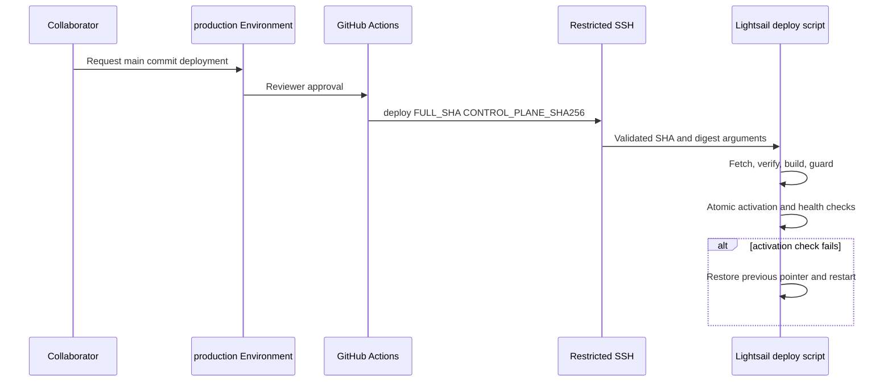
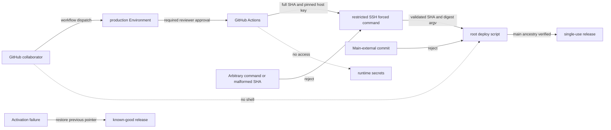

# Lightsail deploy workflow specification

Story: `story-lightsail-deploy-workflow`

## Authority boundary

| Actor | May | Must not |
| --- | --- | --- |
| GitHub collaborator | `workflow_dispatch`でmain上のSHAを指定する | SSH鍵やruntime secretを見る、任意commandを送る |
| Production reviewer | GitHub Environmentで実行を承認・拒否する | 未reviewのcommitをmain外から許可する |
| GitHub Actions | pinned host keyでforced-command SSHを呼ぶ | root shell、interactive shell、secret更新を行う |
| Deploy principal | `deploy <40-hex-sha> <control-plane-sha256>`を受ける | その他のSSH command、port forwarding、PTYを使う、installed deployerの版ずれを許す |
| Root deploy script | fetch、検証、build、atomic activate、restart、rollbackを行う | main外commit、同時deploy、開発runner中のrestartを許す |

## Input contract

- `commit_sha`は省略可能。省略時はworkflow開始時にfetchした`origin/main`のHEADを使う。
- 指定時は40文字の16進SHAで、workflowとserverの双方が`origin/main`のancestorであることを確認する。
- branch名、tag、short SHA、shell fragmentは受け付けない。
- `LIGHTSAIL_DEPLOY_HOST`と`LIGHTSAIL_DEPLOY_KNOWN_HOSTS`はGitHub Environment variables、秘密鍵はEnvironment secretに置く。

## Deployment sequence

1. GitHub Environment承認後にActionsが対象SHAを確定する。
2. 対象SHA上のdeploy script 2本からcontrol-plane digestを計算し、pinned known_hostsと専用秘密鍵で`openryoko-deploy`へ接続して`deploy <sha> <digest>`だけを送る。
3. forced-command wrapperが入力を完全一致で検証し、installed script 2本のdigestが一致した場合だけroot deploy scriptへSHAとdigestを別々のargvとして渡す。root deploy scriptもbuild前にdigestを再検証する。
4. root deploy scriptがlockを取得し、pilot上のcanonical cloneで`origin/main`をfetchする。
5. `$HOME/releases/openryoko/<sha>-<run-id>`へsingle-use detached worktreeを作り、frozen installとbuildを実行する。既存成果物は再利用しない。
6. development runner guardがidle/staleになるまで待つ。
7. `/home/ryoko/current`を新releaseへatomicに切り替え、`openryoko.service`をrestartする。
8. systemd active、active entrypoint、MainPIDのcommand lineがrelease pointerを使うことを確認する。失敗時は直前symlinkへ戻してrestartする。成功時は対象SHA、control-plane digest、MainPID、resolved entrypointをworkflow summaryへ伝播する。

## Failure contract

- invalid/main外SHA、build失敗、lock競合、guard timeout、restart失敗はworkflow失敗として返す。
- build失敗時は未完成worktreeを削除し、active symlinkとserviceを変更しない。
- activation後の失敗は直前releaseが存在する場合に自動rollbackする。
- activation成功後の古いworktree整理失敗はwarningとして記録し、成功したdeployをfailureへ反転しない。
- rollback自体の機能結果は別途確認する。service activeだけでSlack/Web outcomeを保証しない。

## Security contract

- `authorized_keys`は`restrict`とroot-owned forced commandを使う。
- sshdがforced commandを`-c`で起動できるようdeploy userのshellは`/bin/bash`とする。新規・既存accountのpasswordをinstallerが明示的にlockしてshadow上のlock状態も検証し、Actions鍵は`restrict,command="..."`へ固定してinteractive commandを許可しない。
- workflowは`permissions: contents: read`のみを要求する。
- Actions dependencyはfull commit SHAでpinする。
- host key checkingを無効化しない。
- workflow log、GitHub summary、server outputへ鍵、token、environment file内容を出さない。
- deploy scriptを変更したcommitは、setup administratorがその対象SHAからinstallerを再実行するまでfail closedとする。旧installed control planeで新しいrepository testだけが通る状態を成功扱いしない。

## Diagrams

### threat_model

Trust boundaryはGitHub `production` Environment、restricted SSH principal、root deploy scriptの3段階である。各段階は前段の判断を信頼せず、SHA形式・main包含・実行commandを再検証する。

## Verification

- `pnpm test:e2e:deploy`はGitHub UIやLightsail実機のE2Eではなく、Playwrightをrunnerとして使うheadless contract replayである。production journeyの証跡はStoryのR-01〜R-03へ分離する。
- `bash -n`で3本のserver-side scriptを検証する。
- forced commandがarbitrary commandとshort SHAを拒否する。
- valid-form SHAとcontrol-plane digestが別々のargvとしてdeploy scriptへ渡り、digest欠落・不一致をbuild前に拒否することを確認する。
- GitHub workflow YAMLをparseし、`workflow_dispatch`、`environment: production`、read-only permissions、non-cancelling concurrency、strict host key checkingを確認する。
- activation失敗fixtureで直前release pointerへのrollbackと元のfailure status保持を確認する。
- main外commit、lock競合、build失敗、guard timeout、systemd active-check失敗、entrypoint不一致、MainPID command不一致をcaller経路へ注入し、active pointerがknown-good releaseから変わらないことを確認する。
- build失敗時に未完成releaseが削除され、service restartが呼ばれないことを確認する。
- activation成功後のworktree prune失敗がwarningに留まり、deploy成功を反転しないことを確認する。
- 本番導入時はcurrent SHA、installed control-plane digest、deploy account password lock、restricted `authorized_keys`、限定sudoers、arbitrary/short command拒否、systemd MainPID/entrypoint、workflow run URLを記録する。
