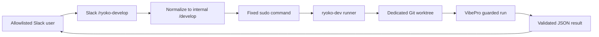
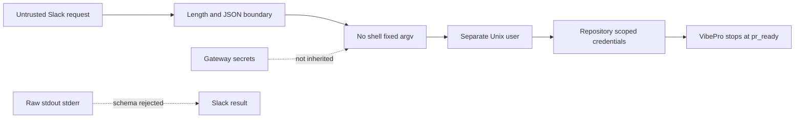

# Slack self-development runner specification

## Configuration contract

```yaml
developmentRunner:
  enabled: false
  bin: /usr/bin/sudo
  args:
    - -n
    - -H
    - -u
    - ryoko-dev
    - /usr/local/libexec/openryoko-development-runner
  timeoutMs: 5400000
  allowedSlackChannels:
    - C0A2L9FEKEJ # mana テスト
```

`bin` must be absolute. Arguments are fixed configuration and must not contain newlines or NUL bytes. The request is encoded as one JSON line on stdin:

```json
{"request":"READMEを改善する"}
```

## Result contract

The runner writes exactly one JSON object to stdout. Allowed fields are `status`, `storyId`, `prUrl`, and `summary`. `status` is one of `queued`, `pr_ready`, `needs_input`, or `failed`. `prUrl`, when present, must identify a pull request in `Unson-LLC/brainbase-mana`. `summary` is required and at most 1000 characters.

Raw stdout, stderr, prompts, transcripts, tokens, and arbitrary URLs are never relayed to Slack.

## Flow diagram



## Threat model



## Explicit scenarios

1. When the feature is absent or disabled, `/ryoko-develop` returns disabled and starts no process.
2. A non-Slack connector does not expose `/develop` and starts no process.
3. An empty request returns usage guidance and starts no process.
4. An unauthorized Slack user receives an ephemeral denial before channel or user lookups. An absent or empty `allowFrom` fails closed for development.
5. An allowed user outside `allowedSlackChannels` receives an ephemeral denial before lookups or dispatch. An absent or empty allowlist fails closed.
6. A request longer than 8000 characters is rejected before process creation.
7. A second request while one is active is rejected rather than silently queued, including across gateway restarts.
8. A valid request is sent as one JSON line on stdin to an absolute executable with fixed arguments.
9. The child environment contains only runtime essentials and does not inherit Slack credentials.
10. Oversized, malformed, foreign-URL, extra-field, timed-out, or non-zero results become a generic safe failure.
11. Timeout sends termination to the child process group, waits for close, then escalates to `SIGKILL` if required.
12. A successful guarded run returns a Story ID and `pr_ready` without creating, merging, or deploying a PR.

## Current reality, invariants, and done evidence

Current reality: the production gateway uses one runtime checkout and one global
Claude working directory. Giving that process write permission would let a Slack
prompt alter the code currently serving Slack.

Invariants: the runtime checkout stays unchanged; the gateway never constructs a
shell command; gateway secrets never enter the development child; one request
owns one Story/worktree; VibePro may stop at `pr_ready` but cannot create a PR,
merge, deploy, change secrets, or write Graph SSOT.

Failure modes are fail-closed: non-Slack ingress, invalid config, input, child exit, timeout, output
size, JSON schema, Story ID, or PR URL produces no privileged follow-up action.
The accepted Slack acknowledgement is not completion evidence.

Done evidence consists of current-HEAD unit tests, typecheck, build, a server-side
`id -un` check proving `ryoko-dev`, an unchanged runtime checkout SHA/status, and
one docs-only Slack request that reaches VibePro `pr_ready` without a PR or deploy.

## Verification

- Unit: slash-command recognition, absolute-bin validation, minimal child environment, stdin request, result schema, URL restriction.
- Integration: root-owned wrapper executes as `ryoko-dev`; `id -un` evidence says `ryoko-dev`; runtime source remains unchanged.
- Pilot E2E: allowlisted Slack user starts a docs-only task and receives a VibePro Story/result without PR creation or deployment.
