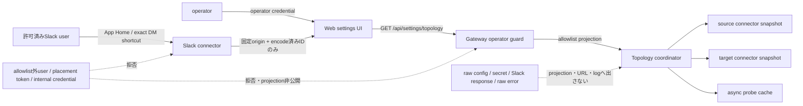

# Mana configuration visibility specification

Story: `story-mana-configuration-visibility`

ADR: [`0005-read-only-configuration-topology`](../adr/0005-read-only-configuration-topology.md)

## Scope

読み取り専用のMana構成projection、5つのWeb表示、Webサイドバー導線、Slack App Home、
明示的なDM設定shortcutを実装する。設定編集、自動修復、Slack transition credentialの
新設は含めない。

## Current reality

旧manaには、議事録を別workspaceへ明示的に共有する契約と運用導線があった。
mana-runtimeへの移行後はその契約が失われ、通常配送と別workspace共有の設定・実行状態を
operatorが安全に確認できるWeb表示も、Slackからその表示へ到達する導線もない。
そのため、通常配送先と共有先の取り違えを事前に発見しにくく、共有先connectorの欠落や
workspace不一致も「未確認」として切り分けられない。

このStoryのローカル実装は読み取り専用projectionとSlack/Web導線を追加するが、
merge、deploy、本番workspaceでの到達・配送結果は別のrelease証拠であり、現時点の完了を意味しない。

## Failure modes

- 通常配送を別workspaceまたは別channelへ誤配送する。
- `shareDestinations` のtarget connectorが存在せず、共有を通常配送として扱う、または黙って消す。
- 宣言workspaceとSlack認証で観測したworkspaceが一致しないのにhealthyと表示する。
- operator以外のcredentialでtopologyを取得でき、routeや選択対象を露出する。
- 任意origin、URL userinfo、token、raw Slack errorをdeep link、API、画面、logへ混入させる。
- reload後も古いprobe/cacheを表示し、削除済みchannelを到達可能と誤認させる。
- App HomeまたはDM shortcutがallowlist外ユーザーへ構成概要を返す。
- loading、empty、認証拒否、取得失敗を空の正常状態として表示する。

## Done evidence

完了判定には、現在のgit状態に紐付いたunit、Story E2E、build、visual QA、権限・secret境界の
focused test、および独立したagent reviewを使う。証拠はprimary/shareの区別、target connector解決、
workspace不一致、未確認理由、operator認証、safe deep link、App Home/DM/sidebar/errorの4入口を覆う。
コード作成、ローカル検証、commit、merge、deploy、本番workspaceでの利用結果は別々に報告し、
後段の状態を前段の証拠から推定しない。

## Threat model



信頼境界はSlack user認可、Web operator認証、gateway projection、connector/probeの4点である。
Webはmutationを持たず、gatewayはrequest中にSlack APIを呼ばず、未観測・失敗はhealthyや空へ
変換せずstable reason付きの `unconfirmed` とする。

## Functional requirements

### FR-01 Redacted topology API

`GET /api/settings/topology` はoperator認証後にversioned JSONを返す。
このendpointはplacement設定が存在しない場合も認証を省略しない。
endpoint専用guardは `operatorAuthorized(req)` を無条件評価し、placement delegation token、
internal notification credential、無credentialを拒否する。既存generic placement gateは流用しない。
レスポンスはArchitectureのallowlist schemaだけで構成し、キー名が
`token|secret|password|credential|env` に該当するフィールドを持たない。

通常配送は `kind: primary`、別workspace共有は `kind: share` とする。
共有先connectorが起動していない、または宣言workspaceと観測workspaceが異なる場合、
routeを削除せずwarningを付ける。

### FR-02 Runtime and probe snapshot

SlackConnectorは最後に認証できたworkspace IDとconnector healthを、安全なsnapshotとして
公開する。gateway topology coordinatorはtop-level/named connectorのlive configを横断し、
router/通常配送先を宣言元connectorへ、`shareDestinations` を `connectorInstanceId` で解決した
target connectorへ割り当てる。全connector生成後、connector再起動、設定reloadのたびに旧plan/cacheを
無効化してから対象channelを非同期probeし、名称、Bot参加、archived、権限、
`checkedAt` をcacheする。raw Slack API responseとraw errorは公開しない。probe未実施、
失敗、snapshot欠落はそれぞれstable reason付きの `unconfirmed` とし、healthyや空へ丸めない。
Socket transport障害時は既存probeを破棄し、stable health codeと障害観測時刻を公開する。
再接続時は最後のprobe planを自動再実行し、確認成功後にrouteをverifiedへ戻す。
単発handler errorはtransport healthをdegradedへ変更せず、runtime errorのraw detailは
snapshot、API、Web、Slack、application logのいずれにも出さない。

### FR-03 Web views

5つのrouteは同じprojectionを用い、次を表示する。

- topology: connector、router channel、project、primary/share edge、warning
- connectors/slack: instance、workspace、health、設定入口状態
- meeting-minutes: project別primary/share route
- permissions: allowlist件数とIM/MPIM/channel respond policy
- history: projection観測時刻と同じtopology responseに含まれるconfig history metadata。
  許可fieldは `ts`、`source`、`file`、`operatorAuthenticated` だけとし、既存
  `/api/config-history`、snapshot名・本文、raw configは使用・公開しない

loading、empty、error + retryを必須とする。desktopでは一覧と詳細を同時表示し、
mobileでは縦積みにする。statusは色だけに依存せず日本語labelを併記する。

### FR-04 Deep links

`workspace`、`project`、`channel` query parameterがrouteと一致すると対象を選択表示する。
不一致は404にせず通常表示し、安全な「対象が見つからない」通知を出す。

meeting-minutesの配送・共有・権限errorを生成する側は、設定済みの固定Web originを使い、
既知のworkspace/project/channel IDだけをencodeしたdeep linkを返す。token、raw error、
任意originはlinkへ含めない。URL未設定時はlinkなしの安全なerror textへfallbackする。
`settingsHome.webBaseUrl` にURL userinfo（`username` または `password`）がある場合も無効とし、
Slack button、deep link、Web originを生成せず、同じ安全な設定不足表示へfallbackする。
credential未保存または401/403のWeb遷移は同じroute上にpassword型promptを表示する。
有効なoperator tokenを既存 `storeOperatorToken` でlocalStorageへ保存した後、現在のroute/queryの
まま再取得する。tokenはURL/query/logへ入れず、拒否時はprojectionと選択対象の存在を露出しない。

### FR-05 Slack App Home

明示的な `allowFrom` に含まれるuserの `app_home_opened` に対して、connector health概要と
「Mana設定を開く」buttonをpublishする。`settingsHome.webBaseUrl` が無効または未設定なら
buttonを出さず、管理者向け設定不足を表示する。allowlist外user、および `allowFrom` が
未設定または空のconnectorでは構成概要を出さず、設定入口をfail-closedにする。

### FR-06 Exact DM shortcut

1:1 DMでtrim後の本文が `設定`、`mana設定`、`ルーティング`、`接続状態` のいずれかと
完全一致したときだけ、設定buttonを返して処理を終了する。この判定はallowlist認可後、
`respondTo` 判定前、かつ `ignoreOldMessagesOnBoot` の古いevent抑止後に行う。古いeventは
shortcut、postMessage、通常handler、session、LLMを一切起動しない。その他のDMは既存policyに従う。

### FR-07 Manifest and existing navigation compatibility

`packages/web/src/lib/slack-manifest.ts` と
`docs/operations/slack/mana-pilot-business-operations.app-manifest.json` はApp Home tabと `app_home_opened` event
subscriptionを有効化し、既存のSocket Mode、messages tab、assistant view、scopes/events、
`/vibepro` を保持する。現行manifestにない `/ryoko-develop` は追加せずconnector handlerも変更しない。
Web sidebarは既存編集用 `/settings` と
読み取り用 `/settings/topology` の双方を到達可能にし、どのrouteでもactive表示は1件だけにする。
desktop/mobileの両導線で同じ契約を満たす。

## Non-functional requirements

- API/Slack/Web/logにsecretを出さない。
- Webは設定mutation APIを呼ばない。
- API projectionは外部Slack APIを同期呼び出ししない。
- keyboard focus、link/button label、semantic heading、mobile 320px以上を支援する。
- 新しいwarning/status codeはstableな英小文字snake_caseとする。

## Configuration

```yaml
connectors:
  slack:
    settingsHome:
      enabled: true
      webBaseUrl: https://mana.example.com
```

named Slack instancesでも同じblockを個別に指定できる。`enabled` の既定はfalse。

## Test cases

1. primaryとshareを含むconfigから別kindのroutesを生成する。
2. source/target connector snapshotが欠けてもrouteを残し `unconfirmed` warningを返す。
3. probe fixtureごとに `bot_not_member`、`channel_archived`、`workspace_mismatch`、`permission_denied`、`channel_not_found`、`slack_probe_failed` のstatus/codeと `checkedAt` を固定する。成功は `channel_ready_by_static_checks` とし実投稿成功とは表示しない。
4. configにtoken/env名があってもserialized projectionへ含まれない。
5. placementあり/なしの双方でoperator credentialなしのAPI requestは401/403となりprojection bodyを返さない。
   placement delegation tokenとinternal notification credentialも拒否し、正しいoperator credentialだけを許可する。
   既存legacy APIのplacement未設定時挙動は変えない。
6. App Homeはtop-level/named connectorのallowlisted userにだけ安全なbuttonを返し、allowFrom未設定・空・対象外は構成概要を返さない。
7. `respondTo.im: never` または通常handler停止中でも `ルーティング` はshortcutを返す。
8. `ルーティングを教えて` は例外にならず通常policyでsilentになる。
9. generated/static Slack manifestがApp Home/eventを含み、既存Socket Mode、messages/assistant、scopes/events、`/vibepro` を保持し、`/ryoko-develop` を新規追加しない。
10. `failRun`、`handleReroute` catch、`loadAuthorizedRun`の権限/channel拒否、`handleShareMinutes`の事前拒否とcatchが安全にencodeしたdeep linkを返し、URL未設定時はlinkなしへfallbackする。
11. credential未保存/拒否のdeep linkは同route上のpromptを表示し、保存後に現在のroute/queryで再取得する。拒否中はprojectionを取得・保持しない。
12. Webの各routeがloading/error/empty/dataを表示し、GET以外を発行しない。
13. deep link queryがprimary/share routeを選択する。
14. `/settings` と `/settings/topology` の双方へ到達でき、sidebarのactive項目はdesktop/mobileとも1件だけになる。
15. App Home、DM、sidebar、実error通知の4入口をE2Eで検証し、対象詳細へ2操作以内で到達する。
16. log secret scan、320px表示、keyboard操作、screen-reader labelは現在のbuild/HEADに紐付けた証跡を残す。
17. top-level source connectorのshare destinationをnamed target connectorへ割り当て、target欠落時は
   `target_connector_missing`、reload後は削除済みchannelの旧cacheなし、HTTP request中はSlack API呼出し0回となる。
18. 古いtimestampの完全一致DMはpostMessage/handler/session/LLMが全て0回で、fresh timestampではshortcutだけ1回となる。
19. `/settings/history` はtopology responseだけを使い、placements有無の双方でoperator認証済み時だけ
   allowlist済み履歴metadataを表示し、snapshot名・本文、raw config、secretを含まない。
20. `settingsHome.webBaseUrl` にURL userinfoがある場合は無効として、App Home button、DM shortcut、
   meeting-minutes error deep link、credential-bearing originを一切出力せず設定不足へfallbackする。

## Release evidence

本番反映はこのPRの完了条件に含めない。release後にoperatorがApp Home、DM、Web sidebar、
error deep linkを確認し、複数workspaceの通常/share route、観測時刻、未確認理由を記録する。
特にlive production HTTPS originで認証済みoperatorが現在のredacted実効設定を取得できた観測を
R-01として必須化し、R-01を含むrelease観測が揃うまでreleaseを完了扱いにしない。
このPRの自動テストは固定HTTPS URL契約とmock HTTPS/browser/API境界までを証明し、live production観測の代替にはしない。
